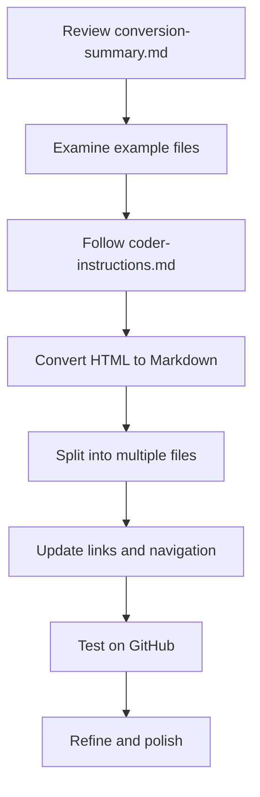

# Maria Documentation Conversion Project

## Overview

This project provides a comprehensive plan and examples for converting the Maria AI Assistant HTML documentation to GitHub-friendly Markdown format. The conversion follows a multi-file approach with a main README.md as an index, organizing the documentation into logical sections for improved navigation and readability.

## Files Created

I've created the following files to guide the conversion process:

### Documentation Structure Examples

| File | Purpose | Description |
|------|---------|-------------|
| [README.md](README.md) | Main index | Example of the main documentation index with overview and table of contents |
| [system-architecture.md](system-architecture.md) | Section example | Example of a top-level section file |
| [functions/README.md](functions/README.md) | Subdirectory index | Example of an index file for the functions section |
| [functions/lambda-function.md](functions/lambda-function.md) | Function description | Example of a detailed function description file |
| [functionality/README.md](functionality/README.md) | Subdirectory index | Example of an index file for the functionality section |
| [functionality/communication.md](functionality/communication.md) | Functionality description | Example of a detailed functionality description file |

### Conversion Guides

| File | Purpose | Description |
|------|---------|-------------|
| [github-conversion-instructions.md](github-conversion-instructions.md) | Detailed instructions | Step-by-step instructions for the HTML to Markdown conversion |
| [conversion-guide.md](conversion-guide.md) | Comprehensive guide | Complete guide with conversion rules, best practices, and examples |
| [conversion-summary.md](conversion-summary.md) | Approach summary | Overview of the conversion approach and file structure |
| [coder-instructions.md](coder-instructions.md) | Implementation steps | Specific instructions for the coder to implement the conversion |

## How to Use These Files

1. **Start with [conversion-summary.md](conversion-summary.md)** to understand the overall approach and file structure.

2. **Review the example files** to see how the documentation should be structured:
   - [README.md](README.md) for the main index format
   - [system-architecture.md](system-architecture.md) for a section file format
   - [functions/README.md](functions/README.md) and [functionality/README.md](functionality/README.md) for subdirectory index formats
   - [functions/lambda-function.md](functions/lambda-function.md) and [functionality/communication.md](functionality/communication.md) for content file formats

3. **Follow the detailed instructions** in [coder-instructions.md](coder-instructions.md) for step-by-step implementation guidance.

4. **Refer to [conversion-guide.md](conversion-guide.md)** for comprehensive conversion rules and best practices.

5. **Use [github-conversion-instructions.md](github-conversion-instructions.md)** for detailed technical instructions on the conversion process.

## Recommended Conversion Workflow

## Key Benefits of This Approach

1. **Improved Navigation**: Users can easily navigate between sections using the table of contents and navigation links.

2. **Better Readability**: Each file focuses on a specific topic, making the documentation easier to read and understand.

3. **Easier Maintenance**: Updates can be made to individual sections without affecting the entire documentation.

4. **GitHub Optimization**: The documentation takes advantage of GitHub's Markdown rendering features, including syntax highlighting and automatic anchor links.

5. **Consistent Structure**: The documentation follows a consistent structure with clear organization and formatting.

## Next Steps

1. Review the provided files and approach
2. Implement the conversion following the instructions in [coder-instructions.md](coder-instructions.md)
3. Test the documentation on GitHub
4. Make any necessary refinements
5. Finalize the documentation

## Conclusion

The provided examples and instructions offer a comprehensive framework for converting the HTML documentation to GitHub-friendly Markdown. By following this approach, the documentation will be well-structured, easy to navigate, and optimized for GitHub's rendering capabilities.