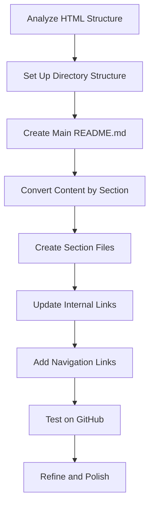

# HTML to GitHub Markdown Conversion Guide

This guide provides a comprehensive roadmap for converting the Maria AI Assistant HTML documentation to GitHub-friendly Markdown format.

## Conversion Roadmap



## Step 1: Analyze HTML Structure

Before beginning the conversion, analyze the HTML documentation to understand:

- The overall structure and organization
- The heading hierarchy
- Special formatting elements (code blocks, tables, etc.)
- Navigation elements
- Any JavaScript functionality that needs to be replaced

## Step 2: Set Up Directory Structure

Create the following directory structure:

```
docs/
├── README.md                       # Main index with overview and TOC
├── system-architecture.md          # System architecture details
├── functionality/
│   ├── README.md                   # Functionality overview
│   ├── communication.md            # Communication details
│   ├── erp-integration.md          # ERP integration details
│   ├── information-retrieval.md    # Information retrieval details
│   ├── document-processing.md      # Document processing details
│   ├── message-management.md       # Message management details
│   └── user-management.md          # User management details
├── functions/
│   ├── README.md                   # Functions overview
│   ├── lambda-function.md          # Lambda function details
│   ├── conversation-management.md  # Conversation management details
│   ├── storage-operations.md       # Storage operations details
│   ├── slack-integration.md        # Slack integration details
│   ├── media-processing.md         # Media processing details
│   ├── erp-integrations.md         # ERP integrations details
│   ├── external-services.md        # External services details
│   ├── web-and-search.md           # Web and search details
│   └── document-management.md      # Document management details
├── routing-configuration.md        # Routing configuration details
├── prompt-configuration.md         # Prompt configuration details
├── invocation-flow.md              # Invocation flow details
└── configuration.md                # Configuration details
```

## Step 3: Create Main README.md

The main README.md serves as the entry point to the documentation. It should include:

- Project title and brief introduction
- Table of contents with links to all sections
- Overview of the system
- List of core modules
- Getting started information

See the [sample README.md](README.md) for reference.

## Step 4: Convert Content by Section

For each section in the HTML document:

1. Identify the corresponding section in the HTML
2. Extract the content
3. Convert to Markdown using the conversion rules
4. Save to the appropriate file in the structure

### HTML to Markdown Conversion Rules

| HTML Element | Markdown Equivalent | Example |
|--------------|---------------------|---------|
| `<h1>` | `# Heading` | `# Main Title` |
| `<h2>` | `## Heading` | `## Section Title` |
| `<h3>` | `### Heading` | `### Subsection Title` |
| `<h4>` | `#### Heading` | `#### Minor Section` |
| `<p>` | Plain text | `This is a paragraph` |
| `<ul><li>` | `- Item` or `* Item` | `- List item` |
| `<ol><li>` | `1. Item` | `1. First item` |
| `<pre><code>` | ````language` | ````python\ndef function():\n    pass```` |
| `<code>` | `` | ``variable`` |
| `<a href="...">` | `[Text](...)` | `[Link](url)` |
| `<strong>` | `**bold**` | `**important**` |
| `<em>` | `*italic*` | `*emphasized*` |
| `<blockquote>` | `> Quote` | `> This is a quote` |
| `<table>` | Markdown table | See below |
| `` | `` | `` |

### Markdown Table Example

```markdown
| Header 1 | Header 2 |
|----------|----------|
| Cell 1   | Cell 2   |
| Cell 3   | Cell 4   |
```

## Step 5: Create Section Files

For each section file:

1. Add a title (H1 heading)
2. Add navigation links at the top and bottom
3. Structure the content with appropriate headings
4. Include code examples with syntax highlighting
5. Add tables where appropriate
6. Include links to related sections

See the [sample system-architecture.md](system-architecture.md) and [sample lambda-function.md](functions/lambda-function.md) for reference.

## Step 6: Update Internal Links

After creating all the files, update all internal links:

1. Links to sections within the same file: `[Text](#heading-id)`
2. Links to other files: `[Text](./path/to/file.md)`
3. Links to sections in other files: `[Text](./path/to/file.md#heading-id)`

Note: GitHub automatically generates heading IDs by converting the heading text to lowercase and replacing spaces with hyphens.

## Step 7: Add Navigation Links

Add consistent navigation links at the top and bottom of each file:

```markdown
[← Back to Main](../README.md) | [Next Section →](next-section.md)
```

For subdirectory index files, include links to parent directories and related sections.

## Step 8: GitHub-Specific Enhancements

### Code Syntax Highlighting

Use language identifiers with code blocks:

````markdown
```python
def lambda_handler(event, context):
    # Process Slack event
```
````

### Collapsible Sections

For lengthy sections:

```markdown
<details>
<summary>Click to expand detailed function list</summary>

- Function 1
- Function 2
- Function 3
</details>
```

### Tables of Contents

For longer files, consider adding a table of contents at the top:

```markdown
## Contents

- [Section 1](#section-1)
- [Section 2](#section-2)
  - [Subsection 2.1](#subsection-21)
  - [Subsection 2.2](#subsection-22)
- [Section 3](#section-3)
```

## Step 9: Test on GitHub

After conversion:

1. Push the changes to a test branch
2. Verify all links work correctly
3. Check formatting on different devices
4. Ensure code blocks render with proper syntax highlighting
5. Test navigation between files

## Step 10: Refine and Polish

After initial testing:

1. Fix any broken links or formatting issues
2. Improve readability where needed
3. Add any missing content
4. Ensure consistent styling across all files
5. Add any additional GitHub-specific features

## Conversion Tools

You can use these tools to help with the initial conversion:

- **Pandoc**: `pandoc -f html -t gfm maria-documentation.html -o temp.md`
- **VS Code extensions**: Markdown All in One, Paste Image, etc.
- **Python scripts**: Use BeautifulSoup to extract and convert content

## Best Practices

1. Use relative links rather than absolute links
2. Keep file names lowercase and use hyphens instead of spaces
3. Be consistent with formatting across all files
4. Include navigation links at the top and bottom of each file
5. Use GitHub-specific Markdown features where appropriate
6. Test thoroughly on GitHub before finalizing

## Example Workflow

1. Convert the HTML to a single Markdown file using Pandoc
2. Split the content into separate files based on the structure
3. Update links and formatting in each file
4. Add navigation links and GitHub-specific features
5. Test on GitHub and refine as needed

## Reference Files

- [Sample README.md](README.md)
- [Sample system-architecture.md](system-architecture.md)
- [Sample lambda-function.md](functions/lambda-function.md)
- [Sample functions/README.md](functions/README.md)
- [Detailed conversion instructions](github-conversion-instructions.md)