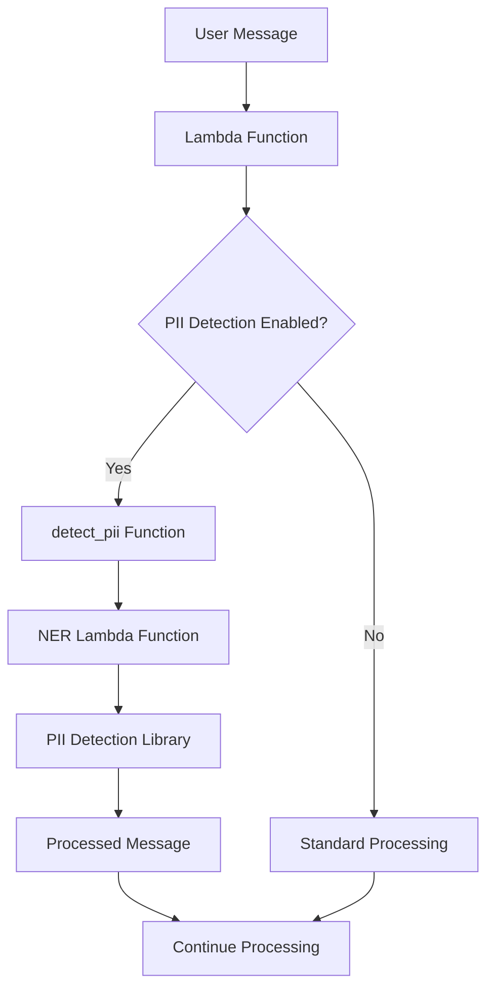

# Privacy Detection

[← Back to Functions](README.md) | [Media Processing](media-processing.md) | [← Back to Main](../README.md)

This document provides detailed technical information about the Privacy Detection functionality in Maria AI Assistant, including PII detection, anonymization processing, and integration with the NER Lambda function.

## Overview

The Privacy Detection system is implemented through a combination of local processing functions and a dedicated Named Entity Recognition (NER) Lambda function. It provides real-time detection and processing of Personally Identifiable Information (PII) in user messages.

## Architecture

### Component Overview



### Core Components

1. **Local PII Detection Function** (`nlp_utils.py`)
2. **NER Lambda Function** (External service)
3. **PII Detection Library** (Integrated with NER Lambda)
4. **Configuration Management** (`lambda_function.py`)

## Implementation Details

### PII Detection Function

Located in [`nlp_utils.py`](../../nlp_utils.py), the `detect_pii()` function serves as the main interface for PII detection:

```python
def detect_pii(payload):
    """
    Detect and process PII in the provided payload.
    
    Args:
        payload: Text content to be analyzed for PII
        
    Returns:
        Processed text with PII handled according to configuration
    """
    try:
        response = client.invoke(
            FunctionName='ner-lambda',
            InvocationType='RequestResponse',
            Payload=json.dumps(payload),
        )
        
        # Check for Lambda execution errors
        if 'FunctionError' in response:
            print(f"Lambda execution error: {repr(response.get('FunctionError'))}")
            return payload
            
        result = json.load(response['Payload'])
        return result
    except Exception as e:
        # Log the error but return the original payload
        print(f"Error invoking Lambda: {repr(e)}")
        return payload
```

### Integration Points

#### Lambda Function Integration

In [`lambda_function.py`](../../lambda_function.py), PII detection is integrated into the main message processing flow:

```python
# Configuration
enable_pii = False  # Default disabled for safety

# Processing integration
if enable_pii:
    text = detect_pii(text)
```

#### Processing Flow

1. **Message Reception**: User message received by Lambda function
2. **Configuration Check**: System checks if `enable_pii` is enabled
3. **PII Detection**: If enabled, message is sent to `detect_pii()` function
4. **NER Processing**: Function invokes external NER Lambda for analysis
5. **Result Processing**: Processed message returned for continued handling
6. **Error Handling**: Graceful fallback to original message if processing fails

## NER Lambda Function

### External Service Architecture

The NER Lambda function is a dedicated service that provides:

- **Named Entity Recognition**: Advanced NLP models for entity detection
- **PII Classification**: Categorization of detected entities as PII
- **Anonymization Processing**: Application of anonymization rules
- **Confidence Scoring**: Reliability metrics for detected entities

### Communication Protocol

```python
# Request format
request_payload = {
    "text": "Message content to analyze",
    "options": {
        "detection_threshold": 0.8,
        "anonymization_strategy": "redact",
        "categories": ["email", "phone", "ssn"]
    }
}

# Response format
response = {
    "processed_text": "Anonymized message content",
    "detections": [
        {
            "entity": "email",
            "confidence": 0.95,
            "start": 10,
            "end": 25,
            "action": "redacted"
        }
    ],
    "metadata": {
        "processing_time": 0.15,
        "model_version": "1.2.3"
    }
}
```

## PII Detection Library

### Core Capabilities

The PII Detection Library integrated with the NER Lambda provides:

#### Supported PII Categories

| Category | Detection Method | Examples |
|----------|------------------|----------|
| **Basic Identity** | NER + Pattern Matching | Names, usernames |
| **Contact Information** | Regex + Validation | Email, phone, address |
| **Government IDs** | Pattern + Checksum | SSN, passport, license |

#### Detection Rules

1. **RegexRule**: Pattern-based detection for structured data
2. **CustomDetectionRule**: Domain-specific detection logic
3. **NER Models**: Machine learning-based entity recognition
4. **Validation Rules**: Checksum and format validation

### Privacy and Security Features

#### Data Protection Principles

- **Consent Management**: Respects user consent for different data types
- **Data Minimization**: Processes only necessary information
- **Purpose Limitation**: Uses data only for intended purposes
- **Transparency**: Provides clear detection explanations
- **Accountability**: Maintains audit logs without storing PII

#### Security Implementation

```python
# Security considerations in the library
class PIIDetector:
    def __init__(self):
        self.audit_log = AuditLog()  # No PII storage
        self.consent_manager = ConsentManager()
        
    def process_text(self, text, context=None):
        # Input validation
        validated_input = self.validate_input(text)
        
        # Consent check
        if not self.consent_manager.has_consent(context):
            return text, []
            
        # Detection with confidence scoring
        detections = self.detect_entities(validated_input)
        
        # Anonymization based on rules
        processed_text = self.anonymize(validated_input, detections)
        
        # Secure audit logging (no PII stored)
        self.audit_log.log_detection(detections, context)
        
        return processed_text, detections
```

## Configuration Options

### Enable/Disable PII Detection

```python
# In lambda_function.py
enable_pii = True   # Enable PII detection
enable_pii = False  # Disable PII detection (default)
```

### Detection Thresholds

```python
# Configuration options for NER Lambda
pii_config = {
    "detection_threshold": 0.8,      # Confidence threshold
    "anonymization_strategy": "redact",  # redact, mask, tokenize
    "categories": ["email", "phone", "ssn"],  # Enabled categories
    "conservative_mode": True,        # Err on side of caution
    "audit_level": "detailed"        # Audit logging level
}
```

### Anonymization Strategies

| Strategy | Description | Example |
|----------|-------------|---------|
| **redact** | Replace with placeholder | `[EMAIL_REDACTED]` |
| **mask** | Partial obscuring | `j***@example.com` |
| **tokenize** | Replace with token | `TOKEN_EMAIL_001` |
| **remove** | Complete removal | `` |

## Error Handling and Resilience

### Graceful Degradation

The system is designed to continue functioning even if PII detection fails:

```python
def detect_pii(payload):
    try:
        # Attempt PII detection
        response = invoke_ner_lambda(payload)
        return process_response(response)
    except Exception as e:
        # Log error for monitoring
        log_error(f"PII detection failed: {e}")
        
        # Return original payload to continue processing
        return payload
```

### Error Types and Handling

| Error Type | Handling Strategy | Impact |
|------------|------------------|---------|
| **Network Timeout** | Return original text | No PII processing |
| **Lambda Error** | Log and fallback | Graceful degradation |
| **Invalid Response** | Validate and retry | Minimal disruption |
| **Rate Limiting** | Queue and retry | Delayed processing |

### Monitoring and Alerts

```python
# Error monitoring integration
def detect_pii_with_monitoring(payload):
    start_time = time.time()
    
    try:
        result = detect_pii(payload)
        
        # Success metrics
        metrics.record_success(time.time() - start_time)
        return result
        
    except Exception as e:
        # Error metrics and alerting
        metrics.record_error(str(e))
        alerts.send_alert(f"PII detection failed: {e}")
        
        return payload
```

## Performance Considerations

### Processing Overhead

- **Typical Latency**: 100-300ms additional processing time
- **Memory Usage**: Minimal additional memory footprint
- **Network Overhead**: Single API call to NER Lambda
- **Caching**: Results cached for repeated content

### Optimization Strategies

1. **Parallel Processing**: PII detection runs concurrently with other operations
2. **Batch Processing**: Multiple messages processed together when possible
3. **Intelligent Caching**: Cache results for identical content
4. **Selective Processing**: Skip detection for non-text content

### Scaling Considerations

```python
# Configuration for high-volume environments
scaling_config = {
    "max_concurrent_requests": 10,
    "request_timeout": 5.0,
    "retry_attempts": 3,
    "circuit_breaker_threshold": 5,
    "cache_ttl": 3600
}
```

## Testing and Validation

### Unit Testing

```python
def test_pii_detection():
    # Test basic PII detection
    text = "Contact John Doe at john@example.com"
    result = detect_pii(text)
    
    assert "[EMAIL_REDACTED]" in result
    assert "john@example.com" not in result

def test_error_handling():
    # Test graceful error handling
    with mock.patch('client.invoke', side_effect=Exception("Network error")):
        result = detect_pii("Test message")
        assert result == "Test message"  # Original text returned
```

### Integration Testing

- **End-to-End Flow**: Test complete message processing with PII detection
- **Error Scenarios**: Validate error handling and fallback behavior
- **Performance Testing**: Measure impact on overall system performance
- **Security Testing**: Verify no PII leakage in logs or responses

## Security Audit and Compliance

### Audit Logging

```python
# Secure audit logging implementation
class SecureAuditLog:
    def log_detection(self, detections, context):
        audit_entry = {
            "timestamp": datetime.utcnow().isoformat(),
            "user_id": hash_user_id(context.user_id),
            "detection_count": len(detections),
            "categories": [d.category for d in detections],
            "confidence_scores": [d.confidence for d in detections],
            # Note: No actual PII values stored
        }
        self.write_audit_log(audit_entry)
```

### Compliance Features

- **Data Subject Rights**: Support for access and deletion requests
- **Consent Management**: Granular consent tracking and enforcement
- **Retention Policies**: Automatic cleanup of audit logs
- **Encryption**: All data encrypted in transit and at rest

## Troubleshooting

### Common Issues

| Issue | Symptoms | Solution |
|-------|----------|----------|
| **High False Positives** | Non-PII detected as PII | Adjust detection threshold |
| **Missed PII** | PII not detected | Lower threshold, add custom rules |
| **Performance Impact** | Slow response times | Enable caching, optimize thresholds |
| **Lambda Errors** | Processing failures | Check NER Lambda logs, verify permissions |

### Debugging Tools

```python
# Debug mode for PII detection
def detect_pii_debug(payload):
    debug_info = {
        "input_length": len(payload),
        "processing_time": 0,
        "detections": [],
        "errors": []
    }
    
    start_time = time.time()
    
    try:
        result = detect_pii(payload)
        debug_info["processing_time"] = time.time() - start_time
        debug_info["output_length"] = len(result)
        
        return result, debug_info
        
    except Exception as e:
        debug_info["errors"].append(str(e))
        return payload, debug_info
```

---

[← Back to Functions](README.md) | [Media Processing](media-processing.md) | [← Back to Main](../README.md)