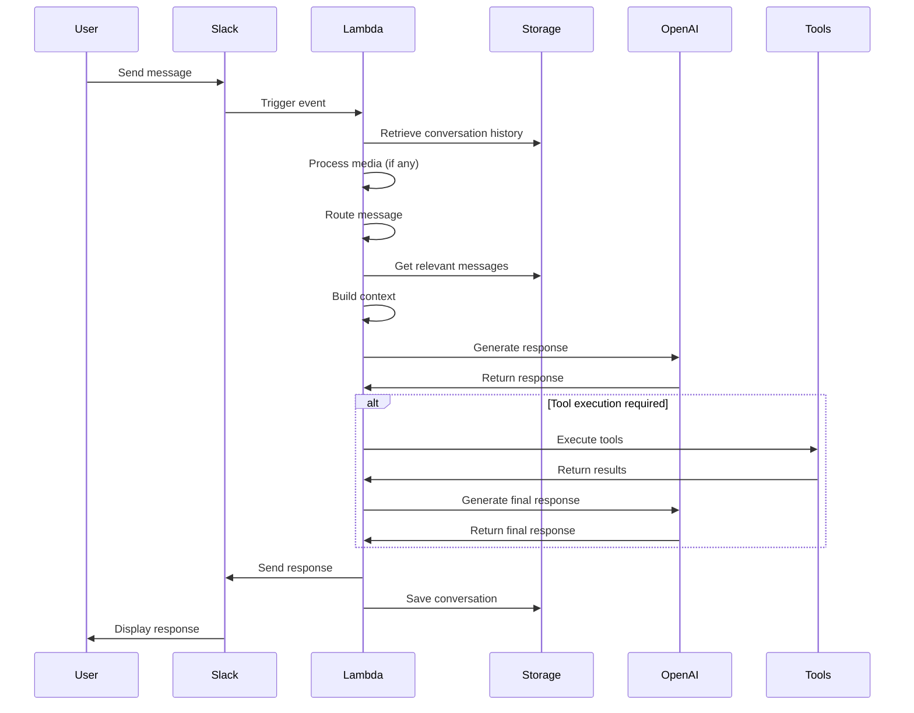

# Invocation Flow

[← Back to Main](README.md) | [Routing Configuration](routing-configuration.md) | [Configuration →](configuration.md)

This document describes the end-to-end invocation flow of the Maria AI Assistant system, from the initial trigger to the final response delivery.

## Overview

The invocation flow represents the complete lifecycle of a user interaction with Maria, including:

- Initial event triggering
- Message processing
- Context building
- Response generation
- Tool execution
- Response delivery

## Flow Diagram



## Detailed Flow Steps

### 1. Initial Trigger

The process begins when a user interacts with Maria through Slack:

- User sends a message in a direct message
- User mentions Maria in a channel
- User replies to a thread where Maria is active

This generates a Slack event that is sent to the AWS Lambda function.

### 2. Event Processing

The Lambda function processes the incoming event:

```python
def lambda_handler(event, context):
    # Extract event data
    event_data = extract_event_data(event)
    
    # Process the event
    response = process_event(event_data)
    
    return response
```

During this phase:
- User, channel, and message information is extracted
- Event type is determined (message, mention, etc.)
- Initial validation is performed

### 3. Message Routing

The message is categorized using the semantic router:

```python
category = determine_category(message_text, routes_config)
system_prompt = prompts[routes_config[category]["system_prompt"]]
available_tools = routes_config[category]["tools"]
```

This determines:
- Which system prompt to use
- Which tools to make available
- How to process the message

### 4. Context Building

Relevant context is gathered to inform the response:

```python
# Get conversation history
conversation_history = get_last_messages(table, chat_id, 10)

# Get relevant messages
relevant_messages = get_relevant_messages("messages", chat_id, message_text, 5)

# Process any attached media
media_content = process_media(event_data.get("files", []))
```

This includes:
- Recent conversation history
- Semantically relevant past messages
- Any attached media (images, audio, documents)
- User-specific context

### 5. Response Generation

The conversation is formatted and sent to OpenAI:

```python
if has_images:
    conversation = make_vision_conversation(
        system_text, assistant_text, display_name, 
        relevant_messages, msg_history_summary, 
        all_messages, text, image_urls
    )
    response = make_openai_vision_call(client, conversation)
else:
    conversation = make_text_conversation(
        system_text, assistant_text, display_name, 
        msg_history_summary, all_messages, text
    )
    response = make_openai_call(client, conversation)
```

The system:
- Formats the conversation appropriately
- Includes relevant context and history
- Sends the request to the OpenAI API
- Receives the initial response

### 6. Tool Execution

If the response includes tool calls, they are executed:

```python
if "tool_calls" in response:
    tool_results = []
    for tool_call in response["tool_calls"]:
        tool_name = tool_call["function"]["name"]
        tool_args = json.loads(tool_call["function"]["arguments"])
        
        result = execute_tool(tool_name, tool_args)
        tool_results.append({
            "tool_call_id": tool_call["id"],
            "output": result
        })
    
    # Get final response with tool results
    final_response = get_response_with_tool_results(conversation, response, tool_results)
```

Tools might include:
- Web search
- ERP system interactions
- Weather data retrieval
- Document processing
- External API calls

### 7. Response Delivery

The final response is formatted and sent to Slack:

```python
# Format the response
formatted_response = format_response(final_response)

# Send to Slack
send_slack_message(formatted_response, chat_id, thread_ts)

# Save the conversation
save_message(table, chat_id, formatted_response, "assistant", thread_ts)
```

This includes:
- Formatting the response for Slack
- Sending the message to the appropriate channel or thread
- Saving the conversation for future reference

## Special Cases

### Audio Processing

When audio is attached:

1. Audio is downloaded and transcribed
2. Transcription is included in the message text
3. Response may be converted to audio using text-to-speech
4. Audio response is uploaded to Slack

### Image Processing

When images are attached:

1. Images are downloaded and processed
2. Image URLs are included in the conversation
3. Vision model is used to analyze the images
4. Response incorporates information from the images

### Document Processing

When documents are attached:

1. Documents are downloaded and processed
2. Text is extracted from the documents
3. Document content is included in the conversation
4. Response incorporates information from the documents

## Error Handling

The system includes comprehensive error handling:

- Connection errors are retried with exponential backoff
- API limits are respected with rate limiting
- Timeouts are handled gracefully
- Fallback responses are provided when necessary
- Errors are logged for monitoring and debugging

## Performance Considerations

The invocation flow is optimized for performance:

- Parallel processing of multiple tools
- Caching of frequently accessed data
- Efficient storage and retrieval operations
- Optimized media processing
- Resource-aware execution

---

[← Back to Main](README.md) | [Routing Configuration](routing-configuration.md) | [Configuration →](configuration.md)