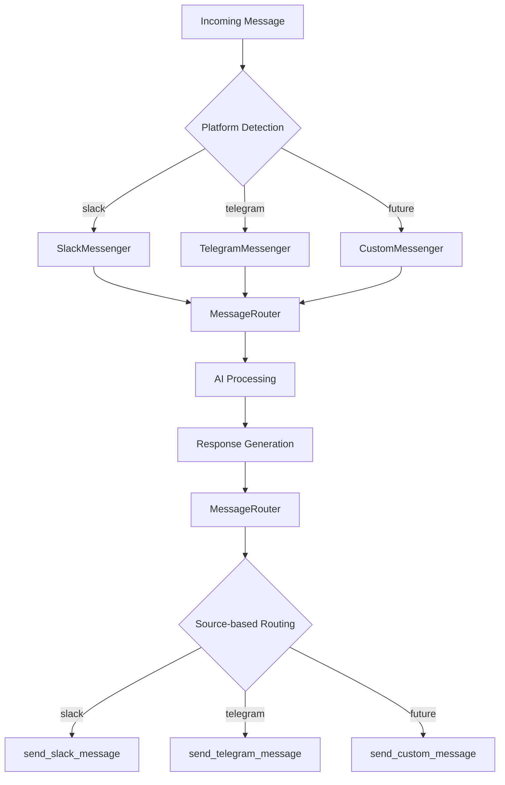

# Unified Messaging System Documentation

## Overview

The Office Assistant now features a unified messaging system that provides a platform-agnostic interface for handling messages across multiple messaging platforms (Slack, Telegram, and future platforms). This system enables consistent AI responses regardless of the source platform while maintaining platform-specific functionality.

## Architecture

### Core Components



### Directory Structure

```
messaging/
├── __init__.py              # Package initialization and exports
├── base.py                  # Abstract MessageSender interface
├── router.py                # Central MessageRouter class
├── slack_messenger.py       # Slack-specific implementation
└── telegram_messenger.py    # Telegram-specific implementation
```

## How It Works

### 1. Message Flow

1. **Incoming Message**: Platform-specific webhook receives message
2. **Event Processing**: `process_*_event()` extracts standardized parameters
3. **Source Tracking**: Global `source` variable tracks message origin
4. **AI Processing**: Uses platform-appropriate tools (dynamically loaded)
5. **Response Routing**: `MessageRouter` sends response via correct platform

### 2. Platform Detection

The system detects the message source in `lambda_function.py`:

```python
# Detect source and process accordingly
source = event.get('source', 'slack')  # Default to slack for backward compatibility

if source == 'telegram':
    processed_data = process_telegram_event(parsed_body)
else:
    processed_data = process_slack_event(parsed_body)
```

### 3. Dynamic Tool Loading

Tools are loaded based on the platform source:

```python
def get_available_functions(source):
    common_functions = {...}  # Platform-agnostic tools
    
    if source == 'slack':
        platform_functions = {...}  # Slack-specific tools
    elif source == 'telegram':
        platform_functions = {...}  # Telegram-specific tools
    
    return {**common_functions, **platform_functions}
```

### 4. Unified Response Handling

All responses go through the `MessageRouter`:

```python
router = get_global_router()

if audio_text:
    router.send_audio(source, chat_id, assistant_reply, thread_id)
else:
    router.send_message(source, chat_id, assistant_reply, thread_id)
```

## Supported Platforms

### ✅ Slack
- **Status**: Fully supported (existing functionality preserved)
- **Features**: Text, audio, files, images, threaded conversations
- **Tools**: `send_slack_message`, `send_audio_to_slack`, `send_file_to_slack`

### ✅ Telegram  
- **Status**: Fully supported (newly implemented)
- **Features**: Text, audio, files, images (no threads - platform limitation)
- **Tools**: `send_telegram_message`, `send_telegram_audio`, `send_telegram_file`

## Adding New Messaging Platforms

Follow this step-by-step guide to add support for a new messaging platform:

### Step 1: Create Platform Integration

Create `{platform}_integration.py` with these functions:

```python
# Example: whatsapp_integration.py

def process_whatsapp_event(whatsapp_event):
    """Process WhatsApp event and return standardized parameters"""
    try:
        # Extract message data
        message = whatsapp_event['message']
        
        return {
            'chat_id': str(message['from']),
            'user_id': str(message['from']),
            'user_name': message.get('profile_name', 'Unknown'),
            'display_name': message.get('profile_name', 'Unknown'),
            'text': message.get('text', ''),
            'thread_ts': str(message.get('timestamp', time.time())),
            'image_urls': [],  # Process message['image'] if needed
            'audio_urls': [],  # Process message['audio'] if needed
            'audio_text': [],
            'application_files': [],  # Process message['document'] if needed
            'event_type': 'message'
        }
    except Exception as e:
        print(f"Error processing WhatsApp event: {e}")
        return None

def send_whatsapp_message(chat_id, message):
    """Send text message via WhatsApp API"""
    # Implement WhatsApp API call
    pass

def send_whatsapp_audio(chat_id, text):
    """Convert text to speech and send via WhatsApp"""
    # Implement WhatsApp audio sending
    pass

def send_whatsapp_file(chat_id, file_data, filename, caption=None):
    """Send file via WhatsApp"""
    # Implement WhatsApp file sending
    pass
```

### Step 2: Create Platform Messenger

Create `messaging/{platform}_messenger.py`:

```python
# Example: messaging/whatsapp_messenger.py

from .base import MessageSender
from whatsapp_integration import send_whatsapp_message, send_whatsapp_audio, send_whatsapp_file

class WhatsAppMessenger(MessageSender):
    def __init__(self):
        self.platform_name = 'whatsapp'
    
    def send_text_message(self, chat_id: str, message: str, thread_id: Optional[str] = None):
        return send_whatsapp_message(chat_id, message)
    
    def send_audio_message(self, chat_id: str, text: str, thread_id: Optional[str] = None):
        return send_whatsapp_audio(chat_id, text)
    
    def send_file_message(self, chat_id: str, file_data: bytes, filename: str,
                         thread_id: Optional[str] = None, caption: Optional[str] = None):
        return send_whatsapp_file(chat_id, file_data, filename, caption)
    
    def send_image_message(self, chat_id: str, image_data: bytes, filename: str,
                          thread_id: Optional[str] = None, caption: Optional[str] = None):
        # WhatsApp can use same API for images and files
        return self.send_file_message(chat_id, image_data, filename, thread_id, caption)
    
    def supports_audio(self) -> bool:
        return True
    
    def supports_files(self) -> bool:
        return True
    
    def supports_images(self) -> bool:
        return True
    
    def supports_threads(self) -> bool:
        return False  # WhatsApp doesn't support threads
    
    def get_platform_name(self) -> str:
        return self.platform_name
    
    def validate_chat_id(self, chat_id: str) -> bool:
        # Implement WhatsApp-specific chat ID validation
        # WhatsApp phone numbers are typically in format: +1234567890
        return chat_id.startswith('+') and len(chat_id) > 10
```

### Step 3: Register the Platform

Update `messaging/router.py` to include the new platform:

```python
def initialize_default_messengers(self) -> None:
    if self._initialized:
        return
    
    try:
        from .slack_messenger import SlackMessenger
        from .telegram_messenger import TelegramMessenger
        from .whatsapp_messenger import WhatsAppMessenger  # Add import
        
        self.register_messenger('slack', SlackMessenger())
        self.register_messenger('telegram', TelegramMessenger())
        self.register_messenger('whatsapp', WhatsAppMessenger())  # Register new platform
        
        self._initialized = True
    except ImportError as e:
        logger.error(f"Failed to initialize messengers: {e}")
        raise
```

### Step 4: Update Lambda Function

Add platform detection in `lambda_function.py`:

```python
# Add import
from whatsapp_integration import process_whatsapp_event, send_whatsapp_message, send_whatsapp_audio

# Update event processing
if source == 'telegram':
    processed_data = process_telegram_event(parsed_body)
elif source == 'whatsapp':  # Add new condition
    processed_data = process_whatsapp_event(parsed_body)
else:
    processed_data = process_slack_event(parsed_body)

# Update tool loading
def get_available_functions(source):
    # ... existing code ...
    elif source == 'whatsapp':  # Add platform tools
        platform_functions = {
            "send_whatsapp_message": send_whatsapp_message,
            "send_whatsapp_audio": send_whatsapp_audio,
            "send_whatsapp_file": send_whatsapp_file,
        }
    # ... rest of function ...
```

### Step 5: Update Package Exports

Update `messaging/__init__.py`:

```python
from .whatsapp_messenger import WhatsAppMessenger  # Add import

__all__ = [
    'MessageSender',
    'MessageRouter', 
    'SlackMessenger',
    'TelegramMessenger',
    'WhatsAppMessenger'  # Add to exports
]
```

### Step 6: Test the Implementation

1. **Unit Tests**: Test the messenger class methods
2. **Integration Tests**: Test with actual platform webhooks
3. **End-to-End Tests**: Verify complete message flow

## Configuration Requirements

### Environment Variables

Each platform requires specific configuration:

```python
# config.py
slack_bot_token = os.getenv('SLACK_BOT_TOKEN')
telegram_bot_token = os.getenv('TELEGRAM_BOT_TOKEN')
whatsapp_api_key = os.getenv('WHATSAPP_API_KEY')  # Example for new platform
```

### Webhook Setup

Configure webhooks for each platform to point to your Lambda function with the appropriate source parameter:

- **Slack**: `POST /webhook?source=slack`
- **Telegram**: `POST /webhook?source=telegram`
- **WhatsApp**: `POST /webhook?source=whatsapp`

## Best Practices

### 1. Error Handling

Always implement comprehensive error handling:

```python
def send_platform_message(self, chat_id: str, message: str, thread_id: Optional[str] = None):
    try:
        result = send_platform_api_call(chat_id, message)
        return result
    except Exception as e:
        logger.error(f"Failed to send {self.platform_name} message: {e}")
        return self.handle_error(e, "send_text_message")
```

### 2. Platform-Specific Validation

Implement proper validation for each platform:

```python
def validate_chat_id(self, chat_id: str) -> bool:
    # Platform-specific validation logic
    # e.g., Slack IDs start with C/D/G/U, Telegram IDs are numeric
    pass
```

### 3. Message Formatting

Handle platform-specific message formatting:

```python
def format_message(self, message: str) -> str:
    # Convert markdown for platform-specific syntax
    # e.g., **bold** -> *bold* for Telegram
    pass
```

### 4. Rate Limiting

Implement rate limiting for each platform:

```python
def send_with_retry(self, api_call, max_retries=3):
    for attempt in range(max_retries):
        try:
            return api_call()
        except RateLimitError as e:
            time.sleep(2 ** attempt)  # Exponential backoff
    raise Exception("Max retries exceeded")
```

### 5. Feature Detection

Use capability methods to handle platform differences:

```python
if messenger.supports_threads():
    messenger.send_text_message(chat_id, message, thread_id)
else:
    messenger.send_text_message(chat_id, message)  # No thread support
```

## Platform-Specific Considerations

### Slack
- **Thread Support**: Full threading with `thread_ts`
- **Rich Formatting**: Supports blocks and rich text
- **File Handling**: Built-in file upload APIs
- **User Management**: Complex workspace/channel structure

### Telegram
- **No Threads**: Single-conversation model
- **Markdown**: Supports basic markdown formatting
- **File Size Limits**: 50MB for files, 20MB for photos
- **Bot Commands**: Supports command-based interactions

### WhatsApp (Example)
- **Phone Numbers**: Uses phone numbers as chat IDs
- **Media Support**: Images, audio, documents, videos
- **No Threads**: Single-conversation model
- **Business API**: Different tiers with different capabilities

## Migration Guide

### From Slack-Only to Unified System

The migration is backward compatible:

1. **Existing Code**: All Slack functionality remains unchanged
2. **New Functionality**: New platforms automatically supported
3. **Gradual Migration**: Can migrate specific functions over time

### Updating Existing Functions

Old Slack-specific code:
```python
send_slack_message(message, chat_id, thread_ts)
```

New unified approach:
```python
router = get_global_router()
router.send_message(source, chat_id, message, thread_ts)
```

## Troubleshooting

### Common Issues

1. **Import Errors**: Ensure all platform messengers are properly imported
2. **Missing Tools**: Check that platform-specific tools are loaded
3. **API Errors**: Verify platform credentials and API endpoints
4. **Rate Limiting**: Implement proper retry logic with exponential backoff

### Debug Logging

Enable debug logging to track message flow:

```python
import logging
logging.basicConfig(level=logging.DEBUG)

logger = logging.getLogger(__name__)
logger.debug(f"Processing {source} message from {chat_id}")
```

## Future Enhancements

### Planned Features

1. **Message Queuing**: Handle high-volume messaging
2. **Analytics**: Track usage across platforms
3. **A/B Testing**: Platform-specific response variations
4. **Multi-Modal Support**: Enhanced media handling
5. **Real-Time Sync**: Cross-platform message synchronization

### Platform Roadmap

- **Discord**: Gaming/community platform support
- **Microsoft Teams**: Enterprise messaging
- **Signal**: Privacy-focused messaging
- **Facebook Messenger**: Social media integration

## Contributing

When adding new platforms:

1. Follow the established patterns
2. Implement all required abstract methods
3. Add comprehensive tests
4. Update documentation
5. Submit pull request with examples

## Support

For issues with the unified messaging system:

1. Check logs for platform-specific errors
2. Verify webhook configuration
3. Test with platform-specific tools
4. Review rate limiting and API quotas
5. Consult platform-specific documentation

---

**Last Updated**: November 2024  
**Version**: 1.0.0  
**Status**: Production Ready