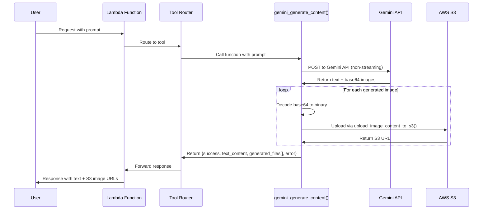

# Gemini Content Generation Integration Plan

## Overview

This document outlines the integration of Gemini's multimodal content generation capabilities into the existing OfficeAssistant system. The integration leverages existing infrastructure including Gemini API configuration, AWS S3 storage, and tool definition patterns.

## System Architecture

```mermaid
graph TB
    A[User Request] --> B[Lambda Function]
    B --> C[Tool Router]
    C --> D[gemini_generate_content Function]
    D --> E[Gemini API]
    D --> F[AWS S3 Upload]
    E --> G[Generated Content + Images]
    F --> H[S3 URLs for Images]
    G --> I[Combined Response]
    H --> I
    I --> J[Return to User]

    subgraph "Files Modified"
        K[media_processing.py<br/>+ gemini_generate_content()]
        L[tools.py<br/>+ tool schema]
        M[config.py<br/>already has gemini_api_key]
    end
```

## Design Principles

1. **Reuse Existing Infrastructure**: Leverage existing Gemini API configuration and S3 upload mechanisms
2. **Consistent Patterns**: Follow existing code patterns in the system
3. **Minimal Changes**: Modify only necessary files with targeted changes
4. **Error Handling**: Maintain robust error handling consistent with system patterns
5. **Message History Compatibility**: S3 URLs work seamlessly with conversation history

## Integration Points

### 1. API Key Management
- ✅ **Current**: [`gemini_api_key`](config.py:12) already configured in config.py
- ✅ **Change**: Remove API key parameter from function signature
- ✅ **Import**: Use `from config import gemini_api_key`

### 2. File Storage Strategy
- ✅ **Current**: AWS S3 with [`image_bucket_name`](config.py:77) = 'mariaimagefolder-us'
- ✅ **Change**: Replace local file saving with S3 upload using existing patterns
- ✅ **Pattern**: Follow existing [`upload_document_to_s3()`](lambda_function.py:623) pattern

### 3. Function Integration
- ✅ **Location**: Add to [`media_processing.py`](media_processing.py) (handles media generation)
- ✅ **Dependencies**: Already has required imports (boto3, base64, mimetypes, etc.)
- ✅ **Return Format**: Keep original structure (success, text_content, generated_files, error)

## Implementation Details

### File Modifications Required

#### 1. media_processing.py - Primary Integration Point

**A. Add Required Import:**
```python
from config import gemini_api_key, image_bucket_name
```

**B. Add Helper Function:**
```python
def upload_image_content_to_s3(image_content: bytes, mime_type: str) -> str:
    """
    Upload image content directly to S3 and return the S3 URL.
    Following the same pattern as upload_document_to_s3.
    
    Args:
        image_content (bytes): Binary image data
        mime_type (str): MIME type of the image (e.g., 'image/png')
    
    Returns:
        str: S3 URL of uploaded image
    """
    image_extension = mimetypes.guess_extension(mime_type) or '.bin'
    s3_object_name = f"Generated_Image_{datetime.datetime.now(datetime.UTC).strftime('%Y%m%d%H%M%S')}{image_extension}"
    
    # Upload to S3
    s3_client = boto3.client('s3')
    s3_client.put_object(Body=image_content, Bucket=image_bucket_name, Key=s3_object_name)
    
    # Construct the S3 URL
    s3_url = f"https://{image_bucket_name}.s3.amazonaws.com/{s3_object_name}"
    return s3_url
```

**C. Add Main Function (Modified from sample):**
```python
def gemini_generate_content(
    prompt: str,
    file_name_prefix: str = "generated_content",
    model: str = "gemini-2.5-flash-image-preview"
) -> Dict[str, Any]:
    """
    Generate content using Google's Gemini API with support for both text and image outputs.
    
    This function integrates with the existing system's Gemini API configuration and
    AWS S3 infrastructure for image storage.
    
    Args:
        prompt (str): The text prompt to send to Gemini
        file_name_prefix (str): Prefix for generated file names (default: "generated_content")
        model (str): Gemini model to use (default: "gemini-2.5-flash-image-preview")
    
    Returns:
        Dict[str, Any]: Dictionary containing:
            - "success": bool indicating if the operation was successful
            - "text_content": str containing all text responses
            - "generated_files": list of S3 URLs for saved images
            - "error": str containing error message if success is False
    """
    
    result = {
        "success": False,
        "text_content": "",
        "generated_files": [],
        "error": ""
    }
    
    try:
        # Use API key from config (already available in system)
        if not gemini_api_key:
            result["error"] = "Gemini API key not found in system configuration"
            return result
        
        # Prepare the API request (non-streaming version)
        url = f"https://generativelanguage.googleapis.com/v1beta/models/{model}:generateContent"
        
        headers = {
            "Content-Type": "application/json",
            "x-goog-api-key": gemini_api_key
        }
        
        # Prepare the request payload
        payload = {
            "contents": [
                {
                    "role": "user",
                    "parts": [
                        {
                            "text": prompt
                        }
                    ]
                }
            ],
            "generationConfig": {
                "response_modalities": ["IMAGE", "TEXT"],
                "temperature": 0.7,
                "topK": 40,
                "topP": 0.95,
                "maxOutputTokens": 8192
            }
        }
        
        # Make the request
        response = requests.post(
            url,
            headers=headers,
            json=payload,
            timeout=300  # 5 minute timeout
        )
        
        if response.status_code != 200:
            result["error"] = f"API request failed with status {response.status_code}: {response.text}"
            return result
        
        response_data = response.json()
        
        # Process the response
        file_index = 0
        text_parts = []
        
        if 'candidates' in response_data and response_data['candidates']:
            candidate = response_data['candidates'][0]
            
            if 'content' in candidate and 'parts' in candidate['content']:
                parts = candidate['content']['parts']
                
                for part in parts:
                    # Handle inline data (images)
                    if 'inlineData' in part:
                        inline_data = part['inlineData']
                        if 'data' in inline_data:
                            # Decode base64 data
                            try:
                                data_buffer = base64.b64decode(inline_data['data'])
                                mime_type = inline_data.get('mimeType', 'image/png')
                                
                                # Upload to S3 using our helper function
                                s3_url = upload_image_content_to_s3(data_buffer, mime_type)
                                result["generated_files"].append(s3_url)
                                file_index += 1
                                
                            except Exception as e:
                                print(f"Error processing image data: {str(e)}")
                    
                    # Handle text data
                    elif 'text' in part:
                        text_content = part['text']
                        text_parts.append(text_content)
        
        # Combine all text content
        result["text_content"] = "".join(text_parts)
        result["success"] = True
        
        print(f"Generation completed successfully!")
        print(f"Text content length: {len(result['text_content'])} characters")
        print(f"Files generated: {len(result['generated_files'])}")
        
    except requests.exceptions.Timeout:
        result["error"] = "Request timed out. The generation may have taken too long."
    except requests.exceptions.RequestException as e:
        result["error"] = f"Request error: {str(e)}"
    except Exception as e:
        result["error"] = f"Error during content generation: {str(e)}"
        print(f"Error: {result['error']}")
    
    return result
```

#### 2. tools.py - Tool Definition

**Add to the tools array:**
```python
{
    "type": "function",
    "function": {
        "name": "gemini_generate_content",
        "description": "Generate creative content including text and images using Google's Gemini API. Creates multimodal content with automatic S3 storage for generated images. Perfect for creating visual content, illustrations, diagrams, and creative writing with accompanying images.",
        "parameters": {
            "type": "object",
            "properties": {
                "prompt": {
                    "type": "string",
                    "description": "The text prompt to send to Gemini for content generation. Can request both text and image content. Examples: 'Create a story about space exploration with illustrations', 'Generate a diagram showing how solar panels work', 'Write a blog post about cooking with food images'"
                },
                "file_name_prefix": {
                    "type": "string", 
                    "description": "Prefix for generated file names stored in S3",
                    "default": "generated_content"
                },
                "model": {
                    "type": "string",
                    "description": "Gemini model to use for generation",
                    "default": "gemini-2.5-flash-image-preview"
                }
            },
            "required": ["prompt"]
        }
    }
}
```

#### 3. No Changes Required
- ✅ [`config.py`](config.py:12) - Already has `gemini_api_key`
- ✅ [`lambda_function.py`](lambda_function.py) - Will automatically discover new tool

## Function Signature Changes

### Original Sample Function
```python
def gemini_generate_content(
    prompt: str,
    output_directory: str = "./generated_files",
    file_name_prefix: str = "generated_content",
    api_key: Optional[str] = None,
    model: str = "gemini-2.5-flash-image-preview"
) -> Dict[str, Any]
```

### Modified Integrated Function
```python
def gemini_generate_content(
    prompt: str,
    file_name_prefix: str = "generated_content",
    model: str = "gemini-2.5-flash-image-preview"
) -> Dict[str, Any]
```

**Key changes:**
- ❌ Removed: `api_key` parameter (uses system config)
- ❌ Removed: `output_directory` parameter (uses S3 storage)
- ✅ Simplified: Focused on essential parameters only

## Return Structure (Unchanged)

```python
{
    "success": bool,              # Operation success status
    "text_content": str,          # Generated text content
    "generated_files": List[str], # List of S3 URLs for generated images
    "error": str                  # Error message if success is False
}
```

**Example Response:**
```python
{
    "success": True,
    "text_content": "Here's a story about a robot learning to paint...",
    "generated_files": [
        "https://mariaimagefolder-us.s3.amazonaws.com/Generated_Image_20241228195530.png",
        "https://mariaimagefolder-us.s3.amazonaws.com/Generated_Image_20241228195531.jpg"
    ],
    "error": ""
}
```

## Implementation Sequence Diagram



## Error Handling Strategy

### 1. API Key Validation
- Check for `gemini_api_key` availability in config
- Return descriptive error if missing

### 2. Network Error Handling
- 300-second timeout for API requests
- Handle `requests.exceptions.RequestException`
- Handle `requests.exceptions.Timeout` specifically

### 3. S3 Upload Error Handling
- Wrap S3 uploads in try/catch blocks
- Continue processing other images if one fails
- Log errors but don't fail entire operation

### 4. Response Processing Error Handling
- Handle malformed JSON responses
- Handle missing expected response fields
- Handle base64 decode failures

### 5. Example Error Response
```python
{
    "success": False,
    "text_content": "",
    "generated_files": [],
    "error": "API request failed with status 429: Rate limit exceeded"
}
```

## Integration Benefits

1. **🔑 Seamless API Management**: Uses existing [`gemini_api_key`](config.py:12) from config
2. **☁️ Consistent Storage**: Follows established S3 patterns with [`image_bucket_name`](config.py:77)
3. **🛠️ Automatic Tool Discovery**: Lambda function will detect new tool schema automatically
4. **📝 Message History Compatible**: S3 URLs work perfectly for conversation history and image retrieval
5. **⚡ Lightweight Responses**: No large base64 data in JSON responses, improving performance
6. **🔄 Reusable Infrastructure**: Leverages existing upload patterns and error handling

## Testing Strategy

### 1. Unit Tests
- Test `upload_image_content_to_s3()` with various image formats
- Test `gemini_generate_content()` with text-only prompts
- Test `gemini_generate_content()` with image-generating prompts
- Test error handling scenarios

### 2. Integration Tests
- Test end-to-end workflow through Lambda function
- Test tool discovery and invocation
- Test S3 URL accessibility and image retrieval

### 3. Manual Testing Examples
```python
# Test text generation only
result = gemini_generate_content("Write a short story about AI")

# Test image + text generation
result = gemini_generate_content("Create a story about robots with illustrations")

# Test different model
result = gemini_generate_content(
    "Generate a technical diagram", 
    model="gemini-2.5-flash-image-preview"
)
```

## Implementation Checklist

- [ ] Add import statement to `media_processing.py`
- [ ] Implement `upload_image_content_to_s3()` helper function
- [ ] Implement `gemini_generate_content()` main function
- [ ] Add tool definition to `tools.py`
- [ ] Test S3 upload functionality
- [ ] Test Gemini API integration
- [ ] Test tool discovery in Lambda function
- [ ] Verify S3 URL accessibility
- [ ] Test error handling scenarios
- [ ] Update documentation if needed

## Usage Examples

### 1. Creative Content Generation
```python
# Through the system
prompt = "Write a children's story about a magical forest with colorful illustrations"
result = gemini_generate_content(prompt)
```

### 2. Technical Documentation
```python
# Through the system  
prompt = "Explain how photosynthesis works and create a diagram showing the process"
result = gemini_generate_content(prompt, file_name_prefix="photosynthesis_diagram")
```

### 3. Marketing Content
```python
# Through the system
prompt = "Create a product description for eco-friendly water bottles with product images"
result = gemini_generate_content(prompt, file_name_prefix="product_marketing")
```

## Conclusion

This integration plan provides a seamless way to add Gemini's multimodal content generation capabilities to the existing OfficeAssistant system. By leveraging existing infrastructure and following established patterns, the implementation will be clean, maintainable, and consistent with the current architecture.

The approach ensures that generated images are properly stored in S3 for long-term accessibility, while maintaining lightweight JSON responses that work well with the messaging system and conversation history features.