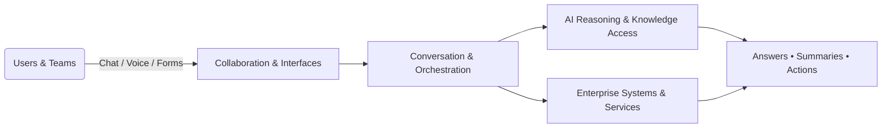

# Guideline: External-Facing Single-Page Maria Documentation (HTML + Markdown Twin)

Version: 1.0  
Date: 2025-08-13  
Owner: Documentation Team  
Source context: Aligns with internal docs set in [docs/README.md](docs/README.md) and related sections.

Purpose
- Provide a definitive guideline to update the single-page Maria documentation to an external-safe, business-focused document that:
  - Contains no code, file names, internal identifiers, or trade secrets.
  - Is self-contained and understandable in isolation by partners and prospective customers.
  - Presents clear value, capabilities, and sector-specific use cases.
  - Is produced in both HTML (single page) and Markdown (twin) formats.

Approved defaults (from stakeholder confirmation)
- Sectors: Manufacturing; Retail & eCommerce; Financial Services; Healthcare; Logistics & Supply Chain; Public Sector; Professional Services.
- Vendor/model references: Generic phrasing only; do not name vendors or model versions.
- Branding references: Use product name “Maria”; refer to the organization as “our team”.
- File placement: Overwrite [docs/maria-documentation.html](docs/maria-documentation.html) and add [docs/maria-documentation.md](docs/maria-documentation.md).

Scope and audience
- Audience: External partners, prospects, evaluators, and potential end users.
- Scope: High-level business outcomes, capabilities, example use cases, data protection principles, onboarding experience, FAQs, and next steps.
- Explicit exclusions for the published document:
  - No source code, code snippets, or pseudo-code.
  - No internal file names, class/function/method identifiers, or prompts.
  - No internal routing logic or schemas.
  - No credentials, keys, tokens, environment details, or proprietary model names.
  - No internal service, repository, or infrastructure identifiers.

Redaction and sanitization policy
- Replace internal terms with generic external-facing concepts:
  - “lambda_function.py” → “event-driven message handler”
  - “conversation.py” → “conversation orchestration”
  - “storage.py” → “secure data storage layer”
  - “slack_integration.py” → “collaboration platform integration”
  - “odoo_get_mapped_models” → “retrieve ERP model metadata”
  - “google_search” → “public web search capability”
- Remove all code and inline code:
  - Strip any fenced code blocks, <pre> blocks, and inline <code> tags.
  - Example in current file: the “Functionality” section uses <code> tags for tool/function names; rewrite as capability phrasing.
- Vendor/model references:
  - Use “state-of-the-art AI” or “advanced language models” unless legal/marketing explicitly approves a vendor/model reference.
- Links:
  - Only include public-safe links or the new Markdown twin in this repo. Avoid internal or private resources.
- Diagrams:
  - Provide conceptual diagrams with generic labels; never include internal component names that map to repositories, files, or services.

Information architecture (final external HTML and Markdown must follow)
1) Executive summary
- One paragraph: what Maria is, who it serves, headline outcomes (efficiency, accuracy, faster decision-making).
2) Key capabilities
- Omnichannel assistance (chat/voice/forms).
- Information retrieval and summarization (public sources and provided content).
- Process orchestration and workflow automation.
- Integrations breadth (generic: collaboration tools, major ERP/line-of-business systems).
- Security and privacy posture (principles-based).
3) Solution overview (high-level)
- Channels supported and extensibility approach in generic language.
- Optional conceptual diagram (generic labels only).
3a) Detailed functionality (required section)
- Include the following subsections with external-safe language:
  - Long-term Context Memory (contextual memory with configurable retention/scope; improves continuity; respects boundaries)
  - Deep Research Mode (iterative multi-step research with recency preference and citations)
  - Proactive Automation & Autonomous Workflows (event-driven initiative under approvals and auditability; e.g., email triage → brief → notify)
  - Communication, Information Assistance, Document Processing, Message Management, User/Admin Controls, Integrations, Workflow Orchestration
  - Capability matrix (inputs → outputs → example results)
4) Industry use cases
- Provide 3–4 examples per sector with outcomes (not features).
- Sectors: Manufacturing; Retail & eCommerce; Financial Services; Healthcare; Logistics & Supply Chain; Public Sector; Professional Services.
- For each sector, include one bullet highlighting the impact of memory and deep research on outcomes.
5) Data protection and privacy
- Data handling principles, retention choices, access control best practices, generic compliance alignments.
- Add an explicit bullet for contextual memory stores (retention windows, opt-out, role-scoped access).
6) Getting started (high-level)
- Typical onboarding experience: discovery, configuration, integration validation, pilot, rollout.
7) Operations and support
- Reliability posture (plain language), support approach, and escalation paths (no internal SLO details).
8) FAQs
- Scope boundaries, customization, data boundaries, security, integration breadth, typical deployment patterns.
- Add FAQs covering memory, research mode, and autonomous actions (policy/approval/audit).
9) Next steps
- Contact and POC/pilot guidance.

Sample external-safe copy blocks (authors may adapt)
- Executive summary
  - “Maria is an enterprise AI assistant that helps teams communicate, find information, and orchestrate routine processes across business systems. Designed for secure, responsible use, Maria accelerates decision-making and improves productivity while fitting naturally into existing collaboration workflows.”
- Capabilities bullets
  - “Assist across chat, voice, and simple forms, meeting teams in their preferred channels.”
  - “Retrieve information from approved sources and summarize it for quick consumption.”
  - “Trigger routine workflows and orchestrate handoffs between people and systems.”
  - “Connects to widely used enterprise platforms to streamline common tasks.”
  - “Built with privacy-first principles for data minimization and access control.”
- Data protection
  - “Our team follows principles of least privilege, configurable retention, and transparent data handling. We support options that align with common enterprise privacy and compliance expectations.”

Industry use cases (examples)
- Manufacturing
  - Production status summaries for shift handovers.
  - Supplier communication drafts and follow-ups.
  - Safety policy Q&A and quick reference guidance.
- Retail & eCommerce
  - Product knowledge assistance for customer support teams.
  - Inventory and order status updates summarized for operations.
  - Campaign content variations and catalog enrichment drafts.
- Financial Services
  - Policy and procedure Q&A for internal teams.
  - Task reminders and checklist orchestration for periodic reviews.
  - Summaries of market and policy updates from approved sources.
- Healthcare
  - Non-clinical operations assistance (scheduling, intake communications).
  - Policy and compliance guidance lookup for staff.
  - Supply and logistics status snapshots for administrators.
- Logistics & Supply Chain
  - Shipment and delivery status rollups for daily standups.
  - Exception triage prompts and follow-up task orchestration.
  - KPI snapshots for fulfillment performance.
- Public Sector
  - Program updates and FAQ preparation for internal teams.
  - Knowledge lookup across approved document sets.
  - Task orchestration for standard operating procedures.
- Professional Services
  - Engagement brief summaries from approved materials.
  - Research synthesis from public sources with citations.
  - Draft internal status updates and follow-ups.

Copy style and tone
- Outcome-first, concise, and jargon-free.
- Consistent use of “Maria” and “our team”.
- Avoid implementation detail; focus on value, clarity, and safety.

HTML template skeleton (authors must adapt; no internal identifiers)
- Use this as the basis for [docs/maria-documentation.html](docs/maria-documentation.html).

```html
<!-- External-facing single-page Maria overview (sanitized) -->
<!DOCTYPE html>
<html lang="en">
<head>
  <meta charset="utf-8" />
  <meta name="viewport" content="width=device-width, initial-scale=1" />
  <title>Maria — External Overview</title>
  <meta name="description" content="Business overview of Maria, an AI assistant for enterprise workflows." />
  <style>
    body { font-family: system-ui, -apple-system, Segoe UI, Roboto, Arial, sans-serif; line-height: 1.6; color: #222; }
    main { max-width: 900px; margin: 0 auto; padding: 2rem 1rem; }
    h1,h2,h3 { margin-top: 1.5rem; }
    a { color: #0b69a3; text-decoration: none; }
    a:hover { text-decoration: underline; }
    .lead { font-size: 1.125rem; margin-top: 0.5rem; }
    ul { padding-left: 1.25rem; }
    .section { margin-top: 2rem; }
    @media print { a::after { content: " (" attr(href) ")"; font-size: 0.9em; } }
  </style>
</head>
<body>
<main>
  <header>
    <h1>Maria: Enterprise AI Assistant</h1>
    <p class="lead">High-level overview of capabilities, value, and example use cases. No code or internal details.</p>
  </header>

  <section id="executive-summary" class="section">
    <h2>Executive Summary</h2>
    <p>...</p>
  </section>

  <section id="capabilities" class="section">
    <h2>Key Capabilities</h2>
    <ul>
      <li>...</li>
      <li>...</li>
    </ul>
  </section>

  <section id="solution-overview" class="section">
    <h2>Solution Overview</h2>
    <p>...</p>
  </section>

  <section id="industry-use-cases" class="section">
    <h2>Industry Use Cases</h2>
    <h3>Manufacturing</h3>
    <ul><li>...</li></ul>
    <h3>Retail & eCommerce</h3>
    <ul><li>...</li></ul>
    <h3>Financial Services</h3>
    <ul><li>...</li></ul>
    <h3>Healthcare</h3>
    <ul><li>...</li></ul>
    <h3>Logistics & Supply Chain</h3>
    <ul><li>...</li></ul>
    <h3>Public Sector</h3>
    <ul><li>...</li></ul>
    <h3>Professional Services</h3>
    <ul><li>...</li></ul>
  </section>

  <section id="data-privacy" class="section">
    <h2>Data Protection and Privacy</h2>
    <p>...</p>
  </section>

  <section id="getting-started" class="section">
    <h2>Getting Started</h2>
    <p>...</p>
  </section>

  <section id="operations-support" class="section">
    <h2>Operations and Support</h2>
    <p>...</p>
  </section>

  <section id="faqs" class="section">
    <h2>FAQs</h2>
    <p>...</p>
  </section>

  <footer class="section">
    <h2>Next Steps</h2>
    <p>...</p>
  </footer>
</main>
</body>
</html>
```

Markdown twin template skeleton
- Create [docs/maria-documentation.md](docs/maria-documentation.md) with identical sections and content.

```md
# Maria: Enterprise AI Assistant

> High-level overview of capabilities, value, and example use cases. No code or internal details.

## Executive Summary
...

## Key Capabilities
- ...
- ...

## Solution Overview
...

## Industry Use Cases
### Manufacturing
- ...

### Retail & eCommerce
- ...
### Financial Services
- ...
### Healthcare
- ...
### Logistics & Supply Chain
- ...
### Public Sector
- ...
### Professional Services
- ...

## Data Protection and Privacy
...

## Getting Started
...

## Operations and Support
...

## FAQs
- ...

## Next Steps
...
```

Conceptual, vendor-agnostic diagram (authors may embed as image in HTML and Mermaid in MD)


Alignment with existing docs (internal crosswalk for authors)
- Use public-safe concepts aligned with:
  - [docs/system-architecture.md](docs/system-architecture.md)
  - [docs/functionality/communication.md](docs/functionality/communication.md)
  - [docs/functionality/erp-integration.md](docs/functionality/erp-integration.md)
  - [docs/functionality/information-retrieval.md](docs/functionality/information-retrieval.md)
  - [docs/functionality/document-processing.md](docs/functionality/document-processing.md)
  - [docs/functionality/message-management.md](docs/functionality/message-management.md)
  - [docs/functionality/user-management.md](docs/functionality/user-management.md)
  - [docs/functionality/privacy-security.md](docs/functionality/privacy-security.md)
- Do not copy file names, function names, or configuration details from [docs/README.md](docs/README.md). Rewrite in capability language.

Remediation of the current HTML (authors’ action plan)
- Source: [docs/maria-documentation.html](docs/maria-documentation.html)
- Key removals and rewrites:
  - Remove the “Core Modules” list that enumerates internal files (e.g., the list beginning around the “Core Modules” subheading). Replace with generic component roles (message handling, orchestration, storage, integrations).
  - Remove all <code> tags in “Functionality” subsections (e.g., web search, ERP integrations). Rewrite as “can perform X” statements in plain language.
  - Revise any headings that imply internal architecture to generic descriptors (e.g., “Routing Configuration” becomes “How requests are handled (conceptual)” if needed, but avoid internal mechanisms).
  - Ensure the final ToC covers only the Information Architecture defined above.
- Replace styling with the lightweight, accessible CSS in the template where possible (or simplify existing CSS) to support readability and printing.

Accessibility, SEO, and presentation
- Headings: semantic H1–H3 structure; scannable bullets.
- Contrast: sufficient for WCAG AA; avoid low-contrast palettes.
- Links: underlined on hover; print includes link targets (see CSS in template).
- Meta: include meaningful title and description; avoid SEO terms that reveal vendors or internals.

Authoring workflow (with evidence of completion)
1) Plan content (DOC-EXT-01)
- Deliver outline and sample copy for each section (this guideline includes both).
2) Redaction pass (DOC-EXT-02)
- Remove code/inline code, file names, internal identifiers, vendor/model names from the current HTML.
- Evidence: diff or summary of removed/replaced elements.
3) Draft the HTML (DOC-EXT-03)
- Overwrite [docs/maria-documentation.html](docs/maria-documentation.html) using the sanitized structure and copy.
4) Create Markdown twin (DOC-EXT-04)
- Create [docs/maria-documentation.md](docs/maria-documentation.md) with equivalent content and anchors.
5) QA checklist (DOC-EXT-05)
- Run the checklist below; record pass/fail with notes.
6) Approvals (DOC-EXT-06)
- Product, Security, and Legal (if required). Record approver and date.
7) Publish and link verification (DOC-EXT-07)
- Ensure any docs index references the updated HTML and new MD twin. Validate external-safety once more.

QA checklist (must pass before external release)
- Redaction
  - [x] No code blocks or inline code/backticks.
  - [x] No file names, function/method/class names, or internal endpoints.
  - [x] No secrets, credentials, tokens, or environment details.
  - [x] No vendor/model names unless explicitly approved.
- Content quality
  - [x] Self-contained narrative with all required sections.
  - [x] Outcome-focused language; no implementation detail required for understanding value.
  - [x] Word count roughly 1200–1800 words; concise, scannable sections.
  - [x] Detailed Functionality includes Long-term Context Memory, Deep Research Mode, and Proactive Automation & Autonomous Workflows.
- Alignment and consistency
  - [x] Consistent with internal concepts without referencing internals.
  - [x] Sectors and use cases reflect approved list and examples.
  - [x] Each sector includes a memory/research impact bullet.
- Accessibility and presentation
  - [x] Semantic headings and sufficient contrast.
  - [x] Links are public-safe and work in print view.
- Final review
  - [ ] Stakeholder approvals captured (Product/Security/Legal as applicable).
  - [x] Final spell-check and broken-link check completed.

Acceptance criteria
- The published [docs/maria-documentation.html](docs/maria-documentation.html) contains only external-safe business content per this guideline.
- A complete Markdown twin exists at [docs/maria-documentation.md](docs/maria-documentation.md).
- QA checklist is fully passed with recorded evidence.
- Approvals are recorded.

Do / Don’t quick reference
- Do: Speak to outcomes and benefits; show sector examples; describe privacy principles.
- Don’t: Show code, internal identifiers, vendor model names, or operational internals.

Tracking: task IDs and checklist
- IDs
  - DOC-EXT-01 Plan content (this guideline): Owner = Docs; Status = Completed on creation of this file.
  - DOC-EXT-02 Redaction pass on current HTML: Owner = Docs; Status = Completed 2025-08-13.
  - DOC-EXT-03 Draft sanitized HTML overwrite: Owner = Docs; Status = Completed 2025-08-13.
  - DOC-EXT-04 Create Markdown twin: Owner = Docs; Status = Completed 2025-08-13.
  - DOC-EXT-05 Run QA checklist: Owner = Docs; Status = Completed 2025-08-13.
  - DOC-EXT-06 Stakeholder approvals: Owner = PM/Sec/Legal; Status = Pending.
  - DOC-EXT-07 Publish and link verification: Owner = Docs; Status = Completed 2025-08-13.

- Checklist (update as work progresses)
  - [x] DOC-EXT-01 Plan content (this guideline document)
  - [x] DOC-EXT-02 Redaction pass on existing HTML (2025-08-13)
  - [x] DOC-EXT-03 Draft sanitized HTML (overwrite docs/maria-documentation.html) (2025-08-13)
  - [x] DOC-EXT-04 Create Markdown twin (docs/maria-documentation.md) (2025-08-13)
  - [x] DOC-EXT-05 QA checklist completed (2025-08-13)
  - [ ] DOC-EXT-06 Approvals recorded
  - [ ] DOC-EXT-07 Publish and verify links

Change log
- v1.0 (2025-08-13): Initial guideline created with full IA, templates, redaction policy, QA, and tracking.

References (internal only for authors)
- Current HTML source to sanitize: [docs/maria-documentation.html](docs/maria-documentation.html)
- Internal docs set for alignment: [docs/README.md](docs/README.md), [docs/system-architecture.md](docs/system-architecture.md), [docs/functionality/communication.md](docs/functionality/communication.md), [docs/functionality/erp-integration.md](docs/functionality/erp-integration.md), [docs/functionality/information-retrieval.md](docs/functionality/information-retrieval.md), [docs/functionality/document-processing.md](docs/functionality/document-processing.md), [docs/functionality/message-management.md](docs/functionality/message-management.md), [docs/functionality/user-management.md](docs/functionality/user-management.md), [docs/functionality/privacy-security.md](docs/functionality/privacy-security.md)