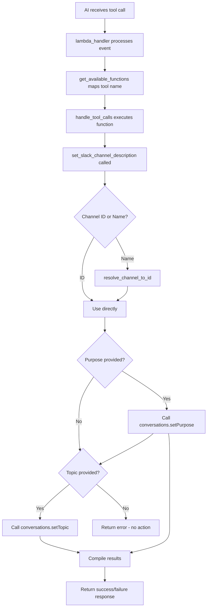

# Implementation Plan: Slack Channel Description Tool

## Overview
This plan outlines the implementation of a new AI tool that allows setting both the purpose (description) and topic of Slack channels. The tool will integrate seamlessly with the existing Office Assistant architecture and follow established patterns.

## Current System Analysis

### Existing Architecture
- **Tools Definition**: [`tools.py`](../tools.py:1) - Contains JSON schema definitions for all AI tools
- **Function Implementation**: [`slack_integration.py`](../slack_integration.py:1) - Contains actual function implementations
- **Function Routing**: [`lambda_function.py`](../lambda_function.py:109-168) - Maps tool names to function implementations via [`get_available_functions()`](../lambda_function.py:109)
- **Tool Execution**: [`conversation.py`](../conversation.py:690-750) - Handles tool call processing via [`handle_tool_calls()`](../conversation.py:690)

### Existing Slack Integration Patterns
- Uses [`slack_sdk.WebClient`](../config.py:35) for API calls
- Functions follow naming convention: `send_slack_*` or `*_slack_*`
- Error handling with try/catch blocks and meaningful error messages
- Integration with DynamoDB for channel/user data via [`get_channels()`](../tools.py:312-325) and [`get_users()`](../tools.py:196-212)

## Implementation Details

### 1. Tool Schema Definition
**File**: [`tools.py`](../tools.py:583)
**Location**: Add after the last tool definition (line 583)

```json
{
    "type": "function",
    "function": {
        "name": "set_slack_channel_description",
        "description": "Sets the purpose (description) and/or topic of a Slack channel. Can update either or both properties. Supports both channel IDs and channel names with automatic resolution.",
        "parameters": {
            "type": "object",
            "properties": {
                "channel": {
                    "type": "string",
                    "description": "The channel ID (e.g., 'C1234567890') or channel name (e.g., 'general', '#general'). Channel names will be automatically resolved to IDs."
                },
                "purpose": {
                    "type": "string",
                    "description": "Optional. The new purpose/description for the channel. This appears in the channel info and describes what the channel is for."
                },
                "topic": {
                    "type": "string", 
                    "description": "Optional. The new topic for the channel. This appears at the top of the channel and is typically used for current discussions or announcements."
                }
            },
            "required": ["channel"]
        }
    }
}
```

### 2. Function Implementation
**File**: [`slack_integration.py`](../slack_integration.py:891)
**Location**: Add after the last function (around line 891)

```python
def set_slack_channel_description(channel, purpose=None, topic=None):
    """
    Sets the purpose (description) and/or topic of a Slack channel.
    
    Parameters:
    - channel: Channel ID or channel name (with or without #)
    - purpose: Optional new purpose/description for the channel
    - topic: Optional new topic for the channel
    
    Returns:
    - dict: Success/failure status with details
    """
    from config import slack_client
    
    if not purpose and not topic:
        return {
            "success": False,
            "error": "At least one of 'purpose' or 'topic' must be provided"
        }
    
    try:
        # Resolve channel name to ID if necessary
        resolved_channel_id = resolve_channel_to_id(channel)
        if not resolved_channel_id:
            return {
                "success": False,
                "error": f"Channel '{channel}' not found"
            }
        
        results = {}
        
        # Set purpose if provided
        if purpose:
            try:
                purpose_response = slack_client.conversations_setPurpose(
                    channel=resolved_channel_id,
                    purpose=purpose
                )
                if purpose_response["ok"]:
                    results["purpose"] = {
                        "success": True,
                        "message": f"Channel purpose updated to: '{purpose}'"
                    }
                else:
                    results["purpose"] = {
                        "success": False,
                        "error": purpose_response.get("error", "Unknown error setting purpose")
                    }
            except Exception as e:
                results["purpose"] = {
                    "success": False,
                    "error": f"Error setting purpose: {str(e)}"
                }
        
        # Set topic if provided
        if topic:
            try:
                topic_response = slack_client.conversations_setTopic(
                    channel=resolved_channel_id,
                    topic=topic
                )
                if topic_response["ok"]:
                    results["topic"] = {
                        "success": True,
                        "message": f"Channel topic updated to: '{topic}'"
                    }
                else:
                    results["topic"] = {
                        "success": False,
                        "error": topic_response.get("error", "Unknown error setting topic")
                    }
            except Exception as e:
                results["topic"] = {
                    "success": False,
                    "error": f"Error setting topic: {str(e)}"
                }
        
        # Determine overall success
        all_successful = all(
            result.get("success", False) 
            for result in results.values()
        )
        
        return {
            "success": all_successful,
            "channel_id": resolved_channel_id,
            "results": results
        }
        
    except Exception as e:
        return {
            "success": False,
            "error": f"Unexpected error: {str(e)}"
        }

def resolve_channel_to_id(channel_identifier):
    """
    Resolves a channel name or ID to a channel ID.
    
    Parameters:
    - channel_identifier: Channel ID, channel name, or #channel-name
    
    Returns:
    - str: Channel ID if found, None otherwise
    """
    # If it looks like a channel ID (starts with C), return as-is
    if channel_identifier.startswith('C') and len(channel_identifier) >= 9:
        return channel_identifier
    
    # Clean channel name (remove # if present)
    channel_name = channel_identifier.lstrip('#')
    
    try:
        # Get all channels and find matching name
        from storage import get_channels
        channels = get_channels()
        
        for channel in channels:
            if channel.get('name') == channel_name:
                return channel.get('id')
        
        # If not found in local cache, try Slack API
        from config import slack_client
        response = slack_client.conversations_list(
            types="public_channel,private_channel"
        )
        
        if response["ok"]:
            for channel in response["channels"]:
                if channel["name"] == channel_name:
                    return channel["id"]
    
    except Exception as e:
        print(f"Error resolving channel '{channel_identifier}': {e}")
    
    return None
```

### 3. Function Registration
**File**: [`lambda_function.py`](../lambda_function.py:147-152)
**Location**: Add to the Slack platform-specific functions (around line 151)

```python
# Platform-specific functions
if source == 'slack':
    platform_functions = {
        "send_slack_message": send_slack_message,
        "send_audio_to_slack": send_audio_to_slack,
        "send_file_to_slack": send_file_to_slack,
        "set_slack_channel_description": set_slack_channel_description,  # ADD THIS LINE
    }
```

### 4. Import Statement
**File**: [`lambda_function.py`](../lambda_function.py:89-94)
**Location**: Add to existing Slack integration imports (around line 93)

```python
from slack_integration import (
    send_slack_message, send_audio_to_slack, send_file_to_slack,
    get_slack_user_name, update_slack_users, update_slack_conversations,
    find_image_urls, latex_to_slack, message_to_json, process_slack_event,
    send_typing_indicator, set_slack_channel_description  # ADD THIS
)
```

## Implementation Flow Diagram



## Error Handling Strategy

### Input Validation
- Ensure at least one of `purpose` or `topic` is provided
- Validate channel identifier format
- Handle both channel IDs and names gracefully

### API Error Handling
- Catch Slack API errors (permissions, rate limits, invalid channels)
- Provide meaningful error messages to the AI
- Handle network timeouts and connection issues

### Fallback Mechanisms
- If local channel cache fails, query Slack API directly
- Graceful degradation if one operation fails but the other succeeds

## Testing Strategy

### Unit Tests
1. **Channel Resolution Tests**
   - Test with valid channel IDs
   - Test with valid channel names (with and without #)
   - Test with invalid channels

2. **API Integration Tests**
   - Test setting purpose only
   - Test setting topic only  
   - Test setting both purpose and topic
   - Test with insufficient permissions

3. **Error Handling Tests**
   - Test with no parameters provided
   - Test with invalid channel identifiers
   - Test API failure scenarios

### Integration Tests
1. **End-to-End Tool Execution**
   - Test via AI tool call mechanism
   - Verify proper JSON response formatting
   - Test with real Slack workspace

## Security Considerations

### Permissions Required
- `channels:write` - To modify public channels
- `groups:write` - To modify private channels
- `channels:read` - To list and resolve channel names
- `groups:read` - To access private channel information

### Access Control
- Function respects existing Slack workspace permissions
- Users can only modify channels they have access to
- Bot token permissions determine accessible channels

## Deployment Steps

1. **Add Tool Schema** - Update [`tools.py`](../tools.py:583) with new tool definition
2. **Implement Function** - Add function to [`slack_integration.py`](../slack_integration.py:891)
3. **Register Function** - Update [`lambda_function.py`](../lambda_function.py:151) imports and function mapping
4. **Test Integration** - Verify tool appears in AI's available functions
5. **Validate Permissions** - Ensure Slack bot has required scopes
6. **Deploy and Monitor** - Deploy changes and monitor for errors

## Usage Examples

### AI Tool Call Examples
```json
// Set both purpose and topic
{
  "channel": "general",
  "purpose": "General discussion and company announcements",
  "topic": "Welcome new team members! 🎉"
}

// Set purpose only
{
  "channel": "C1234567890", 
  "purpose": "Project Alpha development discussions"
}

// Set topic only
{
  "channel": "#random",
  "topic": "Current discussion: Best coffee shops in town ☕"
}
```

### Expected Responses
```json
// Success response
{
  "success": true,
  "channel_id": "C1234567890",
  "results": {
    "purpose": {
      "success": true,
      "message": "Channel purpose updated to: 'General discussion and company announcements'"
    },
    "topic": {
      "success": true, 
      "message": "Channel topic updated to: 'Welcome new team members! 🎉'"
    }
  }
}

// Partial success response
{
  "success": false,
  "channel_id": "C1234567890", 
  "results": {
    "purpose": {
      "success": true,
      "message": "Channel purpose updated to: 'Project discussions'"
    },
    "topic": {
      "success": false,
      "error": "missing_scope: Need groups:write scope to set topic"
    }
  }
}
```

## Summary

This implementation plan provides a comprehensive, production-ready solution that integrates seamlessly with the existing Office Assistant architecture while following established patterns and best practices. The tool supports both channel purposes and topics with flexible parameter handling, robust error management, and proper channel name resolution.