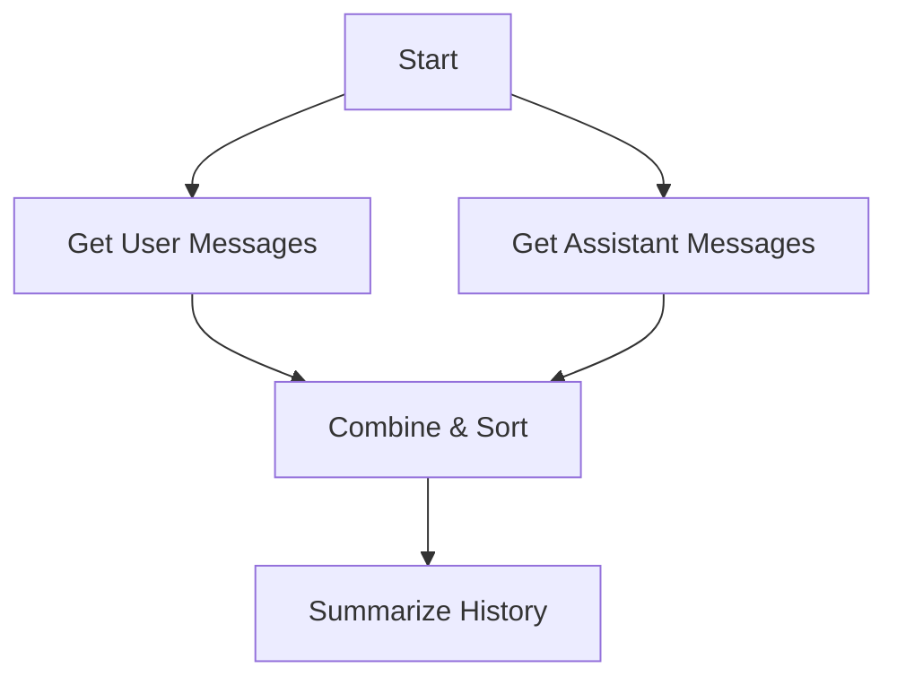
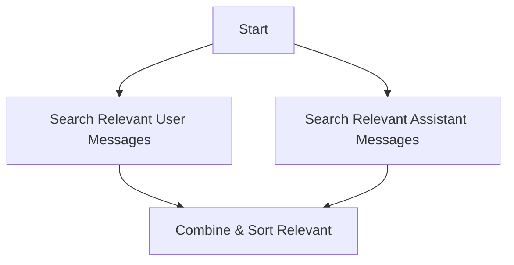
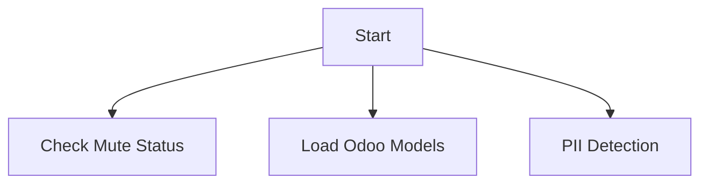
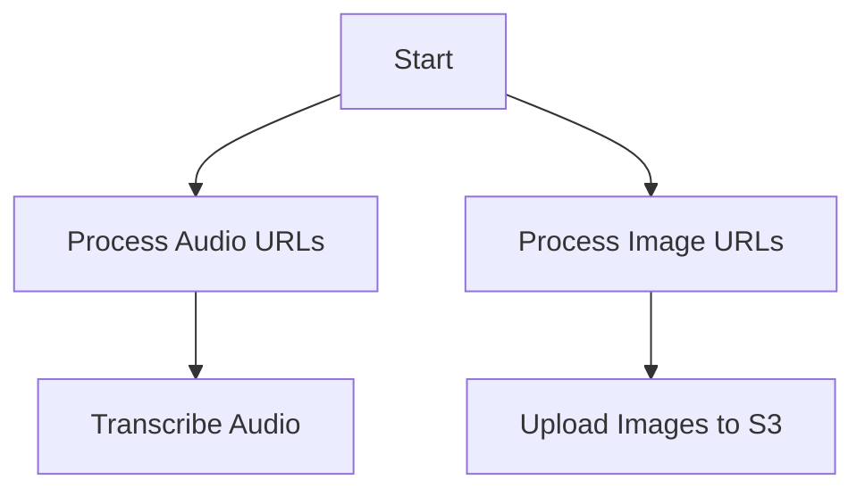

# Lambda Function Parallelization Plan

## Executive Summary

This document outlines a comprehensive plan to parallelize the processing in `lambda_function.py` to improve response times, particularly for operations involving message history retrieval and relevance searches. The analysis identifies multiple independent processing chains that can be executed concurrently, potentially reducing pre-OpenAI processing time by 30-40%.

## Current Serial Processing Flow Analysis

### Overview of Serial Operations

The current implementation processes all operations sequentially before sending a message to OpenAI:

1. **Event Processing** (Lines 190-268)
   - Parse incoming event
   - Process platform-specific data (Slack/Telegram)
   - Extract user info, text, images, audio
   - Process audio transcriptions
   - Process application files

2. **Routing** (Lines 270-285)
   - Determine conversation route using RouteLayer
   - ~100-200ms typical latency

3. **Message History Retrieval** (Lines 314-326)
   - Get user message history from Weaviate
   - Get assistant message history from Weaviate
   - Sort and summarize message history
   - ~500-1000ms typical latency per query

4. **Relevance Search** (Lines 331-341)
   - Search relevant user messages
   - Search relevant assistant messages
   - Combine and sort relevant messages
   - ~300-600ms typical latency per search

5. **Additional Processing** (Lines 328-365)
   - Fetch Odoo models (if needed)
   - Check mute status
   - Find image URLs in messages
   - PII detection (if enabled)

6. **Conversation Building** (Lines 367-387)
   - Build appropriate conversation based on input type

## Identified Independent Processing Chains

### Chain 1: Message History Processing


**Dependencies:** Requires chat_id and num_messages
**Can run in parallel with:** Relevance search, auxiliary processing

### Chain 2: Relevance Search Processing


**Dependencies:** Requires chat_id and query text
**Can run in parallel with:** Message history, auxiliary processing

### Chain 3: Auxiliary Processing


**Dependencies:** Varies by operation
**Can run in parallel with:** All other chains

### Chain 4: Media Processing


**Dependencies:** Media URLs from event
**Can run in parallel with:** Most other operations

## Detailed Implementation Plan

### Phase 1: Core Infrastructure Changes

#### 1.1 Add Timing Utilities

```python
import time
from functools import wraps
from concurrent.futures import ThreadPoolExecutor, as_completed
import asyncio
import aiohttp

# Timing decorator for performance monitoring
def time_operation(operation_name):
    def decorator(func):
        @wraps(func)
        def wrapper(*args, **kwargs):
            start_time = time.time()
            result = func(*args, **kwargs)
            end_time = time.time()
            duration = end_time - start_time
            print(f"[TIMING] {operation_name}: {duration:.3f}s")
            # Optional: Send to CloudWatch metrics
            return result
        return wrapper
    return decorator
```

#### 1.2 Create Parallel Execution Manager

```python
class ParallelExecutor:
    def __init__(self, max_workers=5):
        self.max_workers = max_workers
    
    def execute_parallel_tasks(self, tasks):
        """
        Execute multiple tasks in parallel
        tasks: List of tuples (function, args, kwargs)
        Returns: Dictionary of results keyed by task index
        """
        results = {}
        with ThreadPoolExecutor(max_workers=self.max_workers) as executor:
            # Submit all tasks
            future_to_index = {
                executor.submit(func, *args, **kwargs): idx 
                for idx, (func, args, kwargs) in enumerate(tasks)
            }
            
            # Collect results as they complete
            for future in as_completed(future_to_index):
                idx = future_to_index[future]
                try:
                    results[idx] = future.result()
                except Exception as e:
                    print(f"Task {idx} failed: {e}")
                    results[idx] = None
        
        return results
```

### Phase 2: Refactor Message Retrieval

#### 2.1 Parallel Message History Retrieval

```python
@time_operation("parallel_message_history")
def get_message_history_parallel(chat_id, num_messages, full_text_len):
    """
    Retrieve user and assistant message history in parallel
    """
    executor = ParallelExecutor(max_workers=2)
    
    tasks = [
        (get_last_messages_weaviate, (user_table, chat_id, num_messages), {}),
        (get_last_messages_weaviate, (assistant_table, chat_id, num_messages), {})
    ]
    
    results = executor.execute_parallel_tasks(tasks)
    
    # Process results
    user_messages_full = results.get(0, [])
    assistant_messages_full = results.get(1, [])
    
    # Split into history and recent messages
    user_msg_history = user_messages_full[full_text_len:]
    user_messages = user_messages_full[:full_text_len]
    
    asst_msg_history = assistant_messages_full[full_text_len:]
    assistant_messages = assistant_messages_full[:full_text_len]
    
    # Combine and sort history
    msg_history = user_msg_history + asst_msg_history
    msg_history.sort(key=lambda x: x['sort_key'])
    
    # Combine and sort recent messages
    all_messages = user_messages + assistant_messages
    all_messages.sort(key=lambda x: x['sort_key'])
    
    return msg_history, all_messages, user_messages, assistant_messages
```

#### 2.2 Parallel Relevance Search

```python
@time_operation("parallel_relevance_search")
def get_relevant_messages_parallel(chat_id, text, relevant_count):
    """
    Search for relevant messages in parallel
    """
    if relevant_count <= 0 or not text:
        return []
    
    executor = ParallelExecutor(max_workers=2)
    
    tasks = [
        (get_relevant_messages, (user_table, chat_id, text, relevant_count), {}),
        (get_relevant_messages, (assistant_table, chat_id, text, relevant_count), {})
    ]
    
    results = executor.execute_parallel_tasks(tasks)
    
    # Combine and sort results
    relevant_user_messages = results.get(0, [])
    relevant_assistant_messages = results.get(1, [])
    
    all_relevant_messages = relevant_user_messages + relevant_assistant_messages
    all_relevant_messages.sort(key=lambda x: x['sort_key'])
    
    return all_relevant_messages
```

### Phase 3: Refactor Main Processing Flow

#### 3.1 Parallel Pre-Processing Phase

```python
def parallel_preprocessing(chat_id, text, route_name, relevant_count):
    """
    Execute all pre-processing tasks in parallel
    """
    executor = ParallelExecutor(max_workers=4)
    
    tasks = []
    task_names = []
    
    # Always check mute status
    tasks.append((manage_mute_status, (chat_id,), {}))
    task_names.append('mute_status')
    
    # Conditionally add Odoo models
    if route_name == 'odoo_erp':
        tasks.append((odoo_get_mapped_models, (), {}))
        task_names.append('odoo_models')
    
    # Add relevance search if needed
    if relevant_count > 0 and text:
        tasks.append((get_relevant_messages_parallel, (chat_id, text, relevant_count), {}))
        task_names.append('relevant_messages')
    
    # Execute all tasks
    results = executor.execute_parallel_tasks(tasks)
    
    # Map results to named dictionary
    named_results = {}
    for idx, name in enumerate(task_names):
        named_results[name] = results.get(idx)
    
    return named_results
```

#### 3.2 Refactored Lambda Handler Section

```python
def lambda_handler(event, context):
    # ... (existing event processing code) ...
    
    # After route determination (line ~285)
    
    # Determine parameters based on route
    if route_name == 'chitchat':
        summary_len = 0
        full_text_len = 2
        relevant = 2
        system_text = prompts['instruct_basic']
        assistant_text = ""
    # ... (other route configurations) ...
    
    num_messages = summary_len + full_text_len
    
    # PARALLEL EXECUTION PHASE 1: Message History & Initial Processing
    with ThreadPoolExecutor(max_workers=3) as executor:
        # Submit parallel tasks
        history_future = executor.submit(
            get_message_history_parallel, 
            chat_id, num_messages, full_text_len
        )
        
        preprocess_future = executor.submit(
            parallel_preprocessing,
            chat_id, text, route_name, relevant
        )
        
        # Get results
        msg_history, all_messages, user_messages, assistant_messages = history_future.result()
        preprocess_results = preprocess_future.result()
    
    # Extract preprocessing results
    maria_muted = preprocess_results.get('mute_status', [False])[0]
    models = preprocess_results.get('odoo_models', {})
    all_relevant_messages = preprocess_results.get('relevant_messages', [])
    
    # Handle mute status
    if maria_muted and mentioned_user_id != "U05SSQR07RS":
        save_message(meetings_table, chat_id, text, "user", thread_ts, image_urls)
        return
    
    # Summarize message history
    msg_history_summary = [summarize_messages(msg_history)]
    
    # Find image URLs
    has_image_urls, all_image_urls = find_image_urls(all_messages)
    
    # PII detection if enabled
    if enable_pii:
        text = detect_pii(text)
    
    # ... (continue with conversation building) ...
```

### Phase 4: Advanced Optimizations

#### 4.1 Connection Pooling for Weaviate

```python
# In config.py or at module level
from contextlib import contextmanager
import threading

class WeaviateConnectionPool:
    def __init__(self, cluster_url, api_key, headers, pool_size=5):
        self.pool = []
        self.pool_size = pool_size
        self.cluster_url = cluster_url
        self.api_key = api_key
        self.headers = headers
        self.lock = threading.Lock()
        
        # Initialize pool
        for _ in range(pool_size):
            client = weaviate.connect_to_weaviate_cloud(
                cluster_url=cluster_url,
                auth_credentials=Auth.api_key(api_key),
                headers=headers
            )
            self.pool.append(client)
    
    @contextmanager
    def get_client(self):
        with self.lock:
            client = self.pool.pop()
        try:
            yield client
        finally:
            with self.lock:
                self.pool.append(client)

# Initialize pool
weaviate_pool = WeaviateConnectionPool(weaviate_url, weaviate_api_key, headers)
```

#### 4.2 Async HTTP Operations

```python
async def fetch_external_data_async(urls):
    """
    Fetch data from multiple URLs asynchronously
    """
    async with aiohttp.ClientSession() as session:
        tasks = []
        for url in urls:
            task = asyncio.create_task(fetch_url(session, url))
            tasks.append(task)
        
        results = await asyncio.gather(*tasks, return_exceptions=True)
        return results

async def fetch_url(session, url):
    try:
        async with session.get(url) as response:
            return await response.text()
    except Exception as e:
        print(f"Error fetching {url}: {e}")
        return None
```

### Phase 5: Performance Monitoring

#### 5.1 CloudWatch Metrics Integration

```python
import boto3
from datetime import datetime

cloudwatch = boto3.client('cloudwatch')

def send_metric(metric_name, value, unit='Milliseconds', namespace='OfficeAssistant'):
    """
    Send custom metric to CloudWatch
    """
    try:
        cloudwatch.put_metric_data(
            Namespace=namespace,
            MetricData=[
                {
                    'MetricName': metric_name,
                    'Value': value,
                    'Unit': unit,
                    'Timestamp': datetime.utcnow()
                }
            ]
        )
    except Exception as e:
        print(f"Failed to send metric {metric_name}: {e}")

# Enhanced timing decorator with CloudWatch
def time_operation_with_metrics(operation_name):
    def decorator(func):
        @wraps(func)
        def wrapper(*args, **kwargs):
            start_time = time.time()
            result = func(*args, **kwargs)
            duration = (time.time() - start_time) * 1000  # Convert to ms
            
            print(f"[TIMING] {operation_name}: {duration:.1f}ms")
            send_metric(f"{operation_name}_duration", duration)
            
            return result
        return wrapper
    return decorator
```

#### 5.2 Performance Dashboard Queries

```python
# Log structured data for analysis
def log_performance_data(operation, duration, metadata=None):
    """
    Log performance data in structured format for CloudWatch Insights
    """
    log_entry = {
        "timestamp": datetime.utcnow().isoformat(),
        "operation": operation,
        "duration_ms": duration,
        "metadata": metadata or {}
    }
    print(json.dumps(log_entry))
```

## Expected Performance Improvements

### Baseline Measurements (Serial Processing)
- Message History Retrieval: ~1000-1500ms (2 sequential queries)
- Relevance Search: ~600-1000ms (2 sequential searches)
- Auxiliary Processing: ~200-400ms
- **Total Pre-Processing Time: ~2000-3000ms**

### Expected with Parallelization
- Message History Retrieval: ~500-750ms (parallel queries)
- Relevance Search: ~300-500ms (parallel searches)
- Auxiliary Processing: ~200-400ms (runs concurrently)
- **Total Pre-Processing Time: ~800-1200ms**

### Performance Improvement: **40-60% reduction** in pre-processing time

## Implementation Roadmap

### Week 1: Foundation
1. Implement timing utilities and monitoring
2. Create ParallelExecutor class
3. Add performance logging

### Week 2: Core Parallelization
1. Implement parallel message history retrieval
2. Implement parallel relevance search
3. Test and validate results consistency

### Week 3: Integration & Testing
1. Integrate parallel processing into main handler
2. Comprehensive testing with various scenarios
3. Performance benchmarking

### Week 4: Optimization & Monitoring
1. Implement connection pooling
2. Add CloudWatch metrics
3. Create performance dashboard
4. Fine-tune thread pool sizes

## Risk Mitigation

### Potential Issues and Solutions

1. **Thread Safety**
   - Solution: Use thread-safe operations and proper locking where needed
   - Weaviate client should be thread-safe or use connection pooling

2. **Resource Exhaustion**
   - Solution: Limit thread pool sizes based on Lambda resources
   - Monitor memory usage and adjust accordingly

3. **Error Handling**
   - Solution: Implement proper exception handling in parallel tasks
   - Fallback to serial processing if parallel execution fails

4. **Cold Start Impact**
   - Solution: Keep thread pools small to minimize initialization overhead
   - Consider using Lambda provisioned concurrency for consistent performance

## Monitoring and Alerts

### Key Metrics to Track
1. **Operation Latencies**
   - Message history retrieval time
   - Relevance search time
   - Total pre-processing time

2. **Error Rates**
   - Parallel execution failures
   - Timeout errors
   - Database connection errors

3. **Resource Utilization**
   - Lambda memory usage
   - Thread pool utilization
   - Database connection pool status

### Recommended CloudWatch Alarms
```python
# Example alarm configuration
alarms = [
    {
        "name": "HighPreProcessingLatency",
        "metric": "total_preprocessing_duration",
        "threshold": 3000,  # 3 seconds
        "evaluation_periods": 2,
        "datapoints_to_alarm": 2
    },
    {
        "name": "HighErrorRate",
        "metric": "parallel_execution_errors",
        "threshold": 5,  # errors per minute
        "evaluation_periods": 1,
        "datapoints_to_alarm": 1
    }
]
```

## Required Libraries and Dependencies

### Python Native Libraries (No Lambda Layer Required)
These libraries are part of Python's standard library and don't need to be added to the Lambda layer:

1. **concurrent.futures** - For ThreadPoolExecutor (Python 3.2+)
   - Already available in Lambda Python runtime
   - Used for parallel task execution

2. **threading** - For thread-safe operations and locks
   - Part of Python standard library
   - Used for connection pool management

3. **time** - For timing operations
   - Part of Python standard library
   - Used for performance measurements

4. **functools** - For decorators (@wraps)
   - Part of Python standard library
   - Used for timing decorators

5. **contextlib** - For context managers
   - Part of Python standard library
   - Used for connection pool management

### External Libraries (Lambda Layer Required)
These libraries need to be included in your Lambda layer:

1. **aiohttp** - For async HTTP operations
   - Status: Already imported in lambda_function.py (line 1)
   - Version: Use latest stable (3.9.x recommended)
   - Size: ~3MB

2. **asyncio** - For async/await support
   - Status: Already imported in lambda_function.py (line 2)
   - Note: Part of standard library in Python 3.4+

### Existing Dependencies Check
Based on the current imports in lambda_function.py, all required libraries for parallelization are already available:
- `concurrent.futures` - Already imported (line 6)
- `asyncio` - Already imported (line 2)
- `aiohttp` - Already imported (line 1)

**No additional libraries need to be added to the Lambda layer for this parallelization implementation.**

## Implementation Tracking

### Phase 1: Foundation (Week 1)
| Task ID | Task Description | Status | Owner | Due Date | Notes |
|---------|-----------------|--------|-------|----------|-------|
| P1-001 | Implement timing utilities | Not Started | TBD | Week 1 | Add time_operation decorator |
| P1-002 | Create ParallelExecutor class | Not Started | TBD | Week 1 | Core parallel execution framework |
| P1-003 | Add performance logging infrastructure | Not Started | TBD | Week 1 | Structured logging for CloudWatch |
| P1-004 | Create unit tests for ParallelExecutor | Not Started | TBD | Week 1 | Ensure thread safety |

### Phase 2: Core Parallelization (Week 2)
| Task ID | Task Description | Status | Owner | Due Date | Notes |
|---------|-----------------|--------|-------|----------|-------|
| P2-001 | Implement parallel message history retrieval | Not Started | TBD | Week 2 | Replace lines 315-326 |
| P2-002 | Implement parallel relevance search | Not Started | TBD | Week 2 | Replace lines 331-341 |
| P2-003 | Create parallel preprocessing function | Not Started | TBD | Week 2 | Combine auxiliary operations |
| P2-004 | Add error handling for parallel operations | Not Started | TBD | Week 2 | Fallback mechanisms |
| P2-005 | Performance benchmarking baseline | Not Started | TBD | Week 2 | Measure current latencies |

### Phase 3: Integration & Testing (Week 3)
| Task ID | Task Description | Status | Owner | Due Date | Notes |
|---------|-----------------|--------|-------|----------|-------|
| P3-001 | Integrate parallel processing into lambda_handler | Not Started | TBD | Week 3 | Main integration task |
| P3-002 | End-to-end testing - Slack events | Not Started | TBD | Week 3 | Test all Slack scenarios |
| P3-003 | End-to-end testing - Telegram events | Not Started | TBD | Week 3 | Test all Telegram scenarios |
| P3-004 | Load testing with concurrent requests | Not Started | TBD | Week 3 | Verify thread pool behavior |
| P3-005 | Validate result consistency | Not Started | TBD | Week 3 | Compare with serial processing |

### Phase 4: Optimization & Monitoring (Week 4)
| Task ID | Task Description | Status | Owner | Due Date | Notes |
|---------|-----------------|--------|-------|----------|-------|
| P4-001 | Implement Weaviate connection pooling | Not Started | TBD | Week 4 | Optimize database connections |
| P4-002 | Add CloudWatch custom metrics | Not Started | TBD | Week 4 | Performance monitoring |
| P4-003 | Create CloudWatch dashboard | Not Started | TBD | Week 4 | Visualization |
| P4-004 | Configure CloudWatch alarms | Not Started | TBD | Week 4 | Alerting |
| P4-005 | Fine-tune thread pool sizes | Not Started | TBD | Week 4 | Based on load testing |
| P4-006 | Documentation update | Not Started | TBD | Week 4 | Update system docs |

### Tracking Metrics
To track the success of this implementation, monitor these KPIs:

1. **Performance Metrics**
   - Pre-processing latency (target: <1200ms)
   - Individual operation latencies
   - Thread pool utilization

2. **Reliability Metrics**
   - Parallel execution success rate (target: >99.9%)
   - Fallback activation frequency
   - Error rates by operation type

3. **Resource Metrics**
   - Lambda memory utilization
   - Thread count
   - Database connection count

### Risk Register
| Risk ID | Risk Description | Impact | Probability | Mitigation | Owner |
|---------|-----------------|--------|-------------|------------|-------|
| R-001 | Thread pool exhaustion | High | Medium | Implement queue limits and monitoring | TBD |
| R-002 | Weaviate connection limits | High | Low | Connection pooling with circuit breaker | TBD |
| R-003 | Increased cold start time | Medium | Medium | Keep pool sizes small, use provisioned concurrency | TBD |
| R-004 | Race conditions in shared state | High | Low | Proper locking, immutable data structures | TBD |

### Success Criteria
- [ ] 40% reduction in average pre-processing time
- [ ] No increase in error rates
- [ ] All existing functionality preserved
- [ ] Performance improvements measurable in CloudWatch
- [ ] Documentation updated with new architecture

## Conclusion

This parallelization plan provides a structured approach to improving the performance of the Lambda function, particularly addressing the user complaints about slow responses during message history and relevance searches. The implementation is designed to be incremental, allowing for testing and validation at each stage while maintaining backward compatibility.

The expected 40-60% reduction in pre-processing time should significantly improve the user experience, especially for complex queries that require extensive context retrieval.

All required libraries are already available in the current Lambda environment, making this implementation straightforward without requiring Lambda layer modifications.