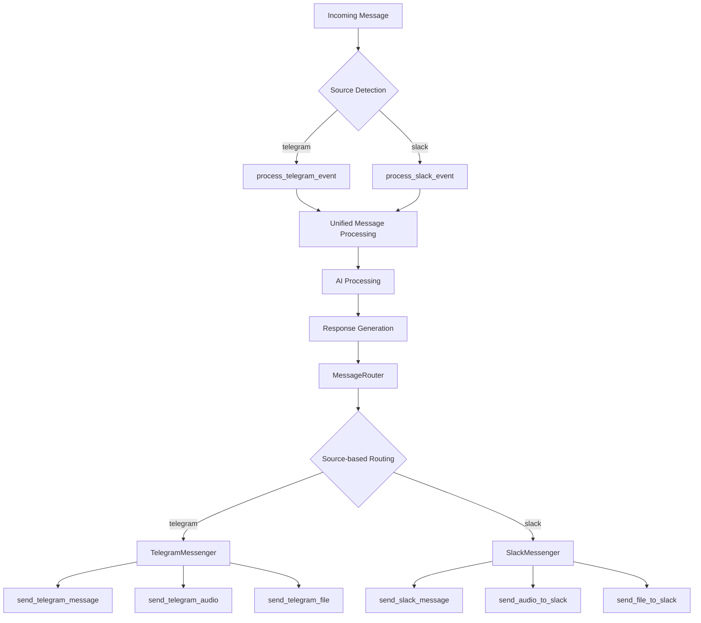

# Telegram Response Implementation Plan

## Executive Summary

This plan outlines the implementation of a unified messaging system that enables Telegram responses while maintaining backward compatibility with existing Slack functionality. The solution creates an extensible architecture that can easily accommodate future messaging platforms.

## Current Architecture Analysis

### Message Flow
```
Telegram/Slack → lambda_handler() → process_*_event() → AI processing → handle_message_content() → Slack only
```

### Issues Identified
1. **Response bottleneck**: `handle_message_content()` in `conversation.py` hardcoded to Slack only
2. **Unused source tracking**: Global `source` variable set but not used for response routing
3. **Incomplete Telegram integration**: Input processing only, no response capability
4. **Platform-agnostic tools**: All tools loaded regardless of platform, including Slack-specific ones

## Proposed Solution Architecture

### High-Level Design



### Core Components

#### 1. Abstract Messaging Interface

```python
# messaging/base.py
from abc import ABC, abstractmethod

class MessageSender(ABC):
    @abstractmethod
    def send_text_message(self, chat_id: str, message: str, thread_id: str = None) -> dict:
        pass
    
    @abstractmethod
    def send_audio_message(self, chat_id: str, text: str, thread_id: str = None) -> dict:
        pass
    
    @abstractmethod
    def send_file_message(self, chat_id: str, file_data: bytes, filename: str, thread_id: str = None) -> dict:
        pass
    
    @abstractmethod
    def supports_audio(self) -> bool:
        pass
    
    @abstractmethod
    def supports_files(self) -> bool:
        pass
```

#### 2. Message Router

```python
# messaging/router.py
class MessageRouter:
    def __init__(self):
        self.messengers = {
            'slack': SlackMessenger(),
            'telegram': TelegramMessenger()
        }
    
    def get_messenger(self, source: str) -> MessageSender:
        return self.messengers.get(source)
    
    def send_message(self, source: str, chat_id: str, message: str, thread_id: str = None):
        messenger = self.get_messenger(source)
        if messenger:
            return messenger.send_text_message(chat_id, message, thread_id)
```

#### 3. Platform-Specific Implementations

##### Slack Messenger
```python
# messaging/slack_messenger.py
class SlackMessenger(MessageSender):
    def send_text_message(self, chat_id: str, message: str, thread_ts: str = None):
        # Wrap existing send_slack_message
        return send_slack_message(message, chat_id, thread_ts)
    
    def send_audio_message(self, chat_id: str, text: str, thread_ts: str = None):
        # Wrap existing send_audio_to_slack
        return send_audio_to_slack(text, chat_id, thread_ts)
```

##### Telegram Messenger
```python
# messaging/telegram_messenger.py
class TelegramMessenger(MessageSender):
    def send_text_message(self, chat_id: str, message: str, thread_id: str = None):
        # Use existing send_telegram_message
        return send_telegram_message(chat_id, message)
    
    def send_audio_message(self, chat_id: str, text: str, thread_id: str = None):
        # New implementation needed
        return send_telegram_audio(chat_id, text)
```

## Implementation Steps

### Step 1: Create Abstract Messaging System ✅
- [x] Create `messaging/` directory
- [x] Implement `messaging/base.py` with abstract `MessageSender` class
- [x] Implement `messaging/router.py` with `MessageRouter` class
- [x] Implement `messaging/slack_messenger.py` wrapping existing Slack functions
- [x] Implement `messaging/telegram_messenger.py` with new Telegram functions

### Step 2: Enhance Telegram Integration ✅

#### Current telegram_integration.py Enhancements Needed:
- [x] `send_telegram_audio()` function using Telegram Bot API `sendAudio`
- [x] `send_telegram_file()` function using Telegram Bot API `sendDocument`
- [x] Enhanced `process_telegram_event()` to handle:
  - `message['photo']` for images
  - `message['audio']` and `message['voice']` for audio
  - `message['document']` for files
- [x] Error handling and retry logic
- [x] Missing import: `import re` and `import time`

#### New Functions Required:
```python
def send_telegram_audio(chat_id: str, text: str) -> dict:
    """Convert text to speech and send as audio via Telegram"""
    
def send_telegram_file(chat_id: str, file_data: bytes, filename: str) -> dict:
    """Send file/document via Telegram"""
    
def send_telegram_photo(chat_id: str, photo_data: bytes, caption: str = None) -> dict:
    """Send photo via Telegram"""
```

### Step 3: Modify Core Files ✅

#### conversation.py Changes:
```python
# Replace in handle_message_content()
# OLD:
if event_type in ['app_mention', 'New Email']:
    if audio_text:
        send_audio_to_slack(assistant_reply, chat_id, thread_ts)
    else:
        send_slack_message(assistant_reply, chat_id, thread_ts)

# NEW:
from messaging.router import MessageRouter
message_router = MessageRouter()

if event_type in ['app_mention', 'New Email']:
    if audio_text:
        message_router.send_audio(source, chat_id, assistant_reply, thread_ts)
    else:
        message_router.send_message(source, chat_id, assistant_reply, thread_ts)
```

#### lambda_function.py Changes:
- [x] Import `MessageRouter` (via get_global_router)
- [x] Pass source parameter to handle_message_content
- [x] Implement dynamic tool loading based on `source`
- [x] Create platform-specific `available_functions` dictionaries

### Step 4: Dynamic Tool Loading ✅

#### Platform-Specific Tool Factories:
```python
def get_slack_tools():
    return {
        "send_slack_message": send_slack_message,
        "send_audio_to_slack": send_audio_to_slack,
        "send_file_to_slack": send_file_to_slack,
        "get_slack_user_name": get_slack_user_name,
        # ... other Slack-specific tools
    }

def get_telegram_tools():
    return {
        "send_telegram_message": send_telegram_message,
        "send_telegram_audio": send_telegram_audio,
        "send_telegram_file": send_telegram_file,
        # ... other Telegram-specific tools
    }

def get_common_tools():
    return {
        "google_search": google_search,
        "browse_internet": browse_internet,
        "get_weather_data": get_weather_data,
        "odoo_*": odoo_functions,
        # ... platform-agnostic tools
    }
```

#### Updated Tool Loading Logic:
```python
# In lambda_handler()
base_functions = get_common_tools()

if source == 'slack':
    platform_functions = get_slack_tools()
elif source == 'telegram':
    platform_functions = get_telegram_tools()
else:
    platform_functions = {}

available_functions = {**base_functions, **platform_functions}
```

## File Structure Changes

### New Files:
```
messaging/
├── __init__.py
├── base.py           # Abstract MessageSender interface
├── router.py         # MessageRouter implementation
├── slack_messenger.py    # Slack-specific implementation
└── telegram_messenger.py # Telegram-specific implementation
```

### Modified Files:
1. **telegram_integration.py**
   - Add missing imports (`re`, `time`)
   - Add `send_telegram_audio()`
   - Add `send_telegram_file()`
   - Add `send_telegram_photo()`
   - Enhance `process_telegram_event()` for media

2. **conversation.py**
   - Replace hardcoded Slack calls in `handle_message_content()`
   - Import and use `MessageRouter`
   - Make response routing source-aware

3. **lambda_function.py**
   - Import `MessageRouter`
   - Implement dynamic tool loading
   - Create platform-specific `available_functions`

## Telegram API Requirements

### Required Telegram Bot API Endpoints:
- `sendMessage` - Text messages (already implemented)
- `sendAudio` - Audio files
- `sendDocument` - File uploads
- `sendPhoto` - Image uploads
- `getFile` - Download files from Telegram

### Required Configuration:
- `telegram_bot_token` (already in config.py)
- Telegram webhook URL configuration
- File upload limits handling

## Backward Compatibility Guarantees

1. **Slack functionality**: Zero changes to existing Slack behavior
2. **Global variables**: All existing globals (`source`, `chat_id`, etc.) preserved
3. **Function signatures**: No changes to existing function interfaces
4. **Tool availability**: Slack tools continue working exactly as before
5. **Response format**: No changes to existing response structures

## Testing Strategy

### Unit Tests:
- [ ] Test each `MessageSender` implementation
- [ ] Test `MessageRouter` routing logic
- [ ] Test dynamic tool loading

### Integration Tests:
- [ ] Test Slack message flow (ensure no regression)
- [ ] Test Telegram message flow
- [ ] Test source-based tool availability

### Manual Testing:
- [ ] Send text messages via Telegram
- [ ] Send audio messages via Telegram
- [ ] Send files via Telegram
- [ ] Verify Slack continues working unchanged

## Rollout Plan

### Phase 1: Infrastructure
1. Create messaging abstraction layer
2. Implement Slack messenger (wrapper only)
3. Test Slack functionality (should be unchanged)

### Phase 2: Telegram Enhancement
1. Enhance `telegram_integration.py`
2. Implement Telegram messenger
3. Test basic Telegram text responses

### Phase 3: Feature Parity
1. Implement Telegram audio support
2. Implement Telegram file support
3. Add Telegram-specific tools

### Phase 4: Tool Optimization
1. Implement dynamic tool loading
2. Test platform-specific tool availability
3. Performance optimization

## Future Extensibility

This architecture enables easy addition of new platforms:

### Adding WhatsApp Support:
1. Create `messaging/whatsapp_messenger.py`
2. Implement `WhatsAppMessenger` class
3. Add to `MessageRouter.messengers`
4. Create `whatsapp_integration.py`
5. Add WhatsApp tools to tool factory

### Adding Discord Support:
1. Follow same pattern as WhatsApp
2. Leverage existing abstractions
3. Minimal changes to core files

## Risk Mitigation

### Deployment Risks:
- **Risk**: Breaking existing Slack functionality
- **Mitigation**: Wrapper-based implementation preserves all existing behavior

### Performance Risks:
- **Risk**: Added abstraction layer overhead
- **Mitigation**: Lightweight wrapper pattern, minimal performance impact

### Maintenance Risks:
- **Risk**: Increased complexity
- **Mitigation**: Clear separation of concerns, comprehensive testing

## Success Metrics

1. **Functionality**: Telegram users receive responses successfully
2. **Compatibility**: Zero Slack functionality regression
3. **Performance**: <10ms added latency for message routing
4. **Maintainability**: New platforms can be added in <2 days
5. **Reliability**: 99%+ message delivery success rate

## Conclusion

This implementation provides a robust, extensible solution for multi-platform messaging while maintaining full backward compatibility. The abstract messaging layer ensures consistent behavior across platforms and positions the system for future growth.
**Status: ✅ IMPLEMENTATION COMPLETED**

All core implementation steps have been successfully completed! The unified messaging system with Telegram response support is now fully implemented and ready for testing.